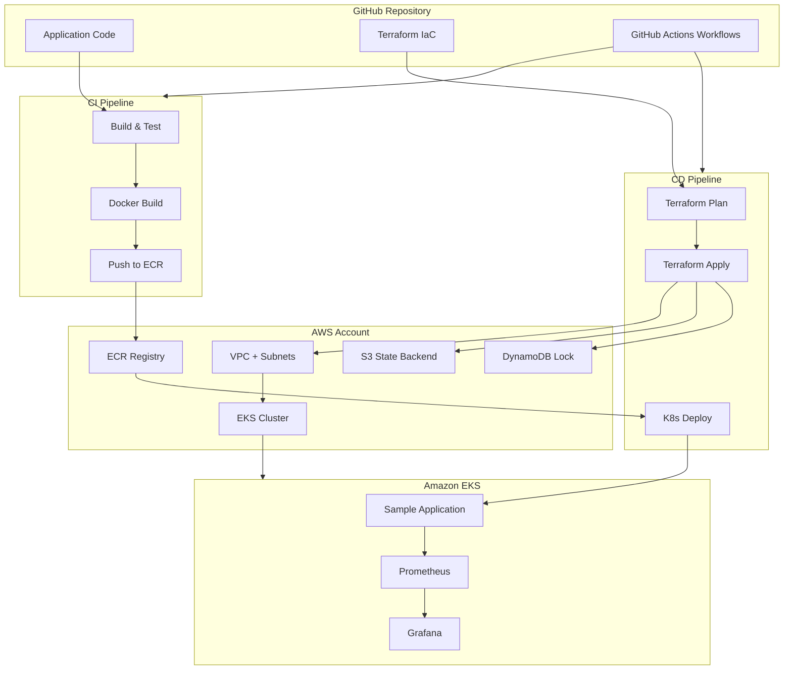

# GitHub CI/CD with AWS EKS and Terraform

A production-quality, beginner-to-advanced, hands-on course that teaches you to build a complete **GitHub Actions CI/CD pipeline** deploying applications to **Amazon EKS** using **Terraform**.

**Region:** `us-east-1` (configurable)  
**Audience:** Developers and DevOps engineers with basic AWS, Linux, and Git experience  
**Outcome:** A multi-environment, production-ready pipeline with infrastructure-as-code, container builds, Kubernetes deployments, monitoring, and approval gates.

---

## Course Architecture



---

## Module Map

| Module | Topic | Deliverable |
| --- | --- | --- |
| [01](module-01-introduction/) | Introduction | Course architecture & tooling setup |
| [02](module-02-terraform/) | Terraform Fundamentals | S3 bucket with variables, outputs, backend |
| [03](module-03-networking/) | AWS Networking | VPC, subnets, NAT, IGW, route tables |
| [04](module-04-eks/) | Amazon EKS | EKS cluster with managed node groups |
| [05](module-05-kubernetes/) | Deploy Sample App | Nginx app on EKS with manifests |
| [06](module-06-github-actions/) | GitHub Actions Fundamentals | Workflow syntax, jobs, secrets |
| [07](module-07-ci/) | CI Pipeline | Build, test, Docker build, ECR push |
| [08](module-08-cd/) | CD Pipeline | Deploy to EKS, rolling updates, rollback |
| [09](module-09-terraform-pipeline/) | Terraform in CI/CD | Plan, apply, destroy, remote backend |
| [10](module-10-production/) | Production Best Practices | IAM, secrets, branch protection, reusable workflows |
| [11](module-11-monitoring/) | Monitoring | Prometheus, Grafana, logs, dashboard |
| [12](module-12-capstone/) | Final Capstone | Full Dev/Stage/Prod pipeline with approvals |

---

## Prerequisites

| Tool | Version | Purpose |
| --- | --- | --- |
| AWS CLI | v2+ | AWS authentication and EKS access |
| Terraform | 1.5+ | Infrastructure provisioning |
| kubectl | 1.28+ | Kubernetes cluster management |
| Docker | 24+ | Container builds |
| Git | 2.30+ | Version control |
| GitHub account | — | CI/CD platform |

### AWS Permissions

You need an AWS account with permissions to create VPC, EC2, EKS, ECR, IAM, S3, and DynamoDB resources. Use a **sandbox account** with billing alarms.

### Cost Warning

EKS control plane (~$0.10/hr), NAT Gateway (~$0.045/hr + data), and EC2 nodes incur charges. **Destroy resources when not in use.** Estimated cost for the full course: $20–50 if completed over a week.

---

## How Each Module Is Organized

```text
module-NN-name/
├── README.md       # Theory, architecture, step-by-step guide, quiz
├── EXERCISE.md     # Hands-on exercise (no solutions)
└── solution/       # Complete working code with explanations
```

1. Read the **README** for concepts and instructions.
2. Complete the **EXERCISE** on your own.
3. Compare with the **solution** when stuck or after finishing.

---

## Quick Start

```bash
# Clone the repository
git clone <your-repo-url>
cd github-actions-terraform-eks-course

# Start with Module 01
cd module-01-introduction
cat README.md

# Configure AWS
aws configure
# or: aws sso login --profile your-profile

# Install tools (macOS example)
brew install terraform kubectl docker
```

---

## Learning Path

```mermaid
graph LR
    M01[01 Intro] --> M02[02 Terraform]
    M02 --> M03[03 Networking]
    M03 --> M04[04 EKS]
    M04 --> M05[05 K8s App]
    M05 --> M06[06 GH Actions]
    M06 --> M07[07 CI]
    M07 --> M08[08 CD]
    M08 --> M09[09 TF Pipeline]
    M09 --> M10[10 Production]
    M10 --> M11[11 Monitoring]
    M11 --> M12[12 Capstone]
```



---

## License

MIT — use freely for self-study, workshops, and internal training.
