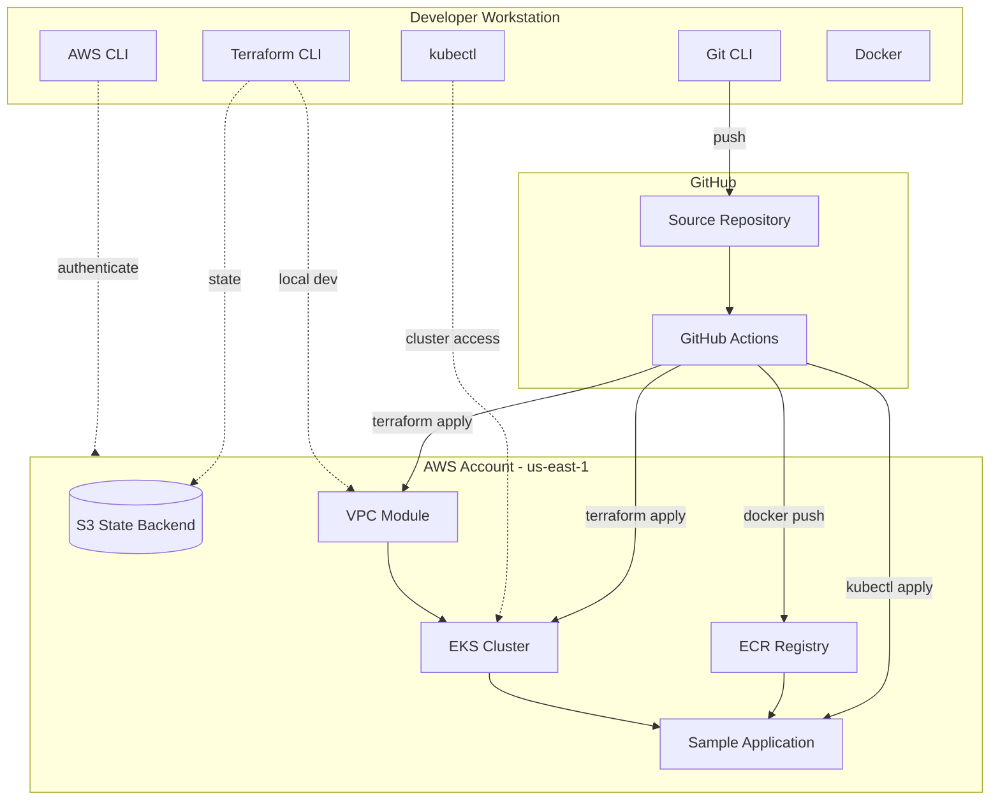

# Module 01: Introduction to CI/CD, GitHub Actions, Terraform, Kubernetes, and Amazon EKS

Welcome to the first module of the **GitHub CI/CD with AWS EKS and Terraform** course. You will learn the foundational concepts that every subsequent module builds upon and prepare your local development environment.

---

## Learning Objectives

By the end of this module, you will be able to:

1. Explain what CI/CD is and why teams adopt it for cloud-native applications.
2. Describe how GitHub Actions fits into a modern delivery pipeline.
3. Summarize what Terraform does and how Infrastructure as Code (IaC) differs from manual console work.
4. Define core Kubernetes concepts: cluster, node, pod, deployment, and service.
5. Explain what Amazon EKS provides and how it relates to self-managed Kubernetes.
6. Map the end-to-end architecture of this course from code commit to running workload on EKS.
7. Install and verify the local toolchain required for the rest of the course.

---

## Theory

### What Is CI/CD?

**Continuous Integration (CI)** is the practice of merging code changes frequently and validating each change with automated builds and tests. **Continuous Delivery (CD)** extends CI by automatically preparing releases so that any validated commit can be deployed to production with minimal manual steps.

Together, CI/CD reduces deployment risk, shortens feedback loops, and makes infrastructure and application changes repeatable.

### GitHub Actions

GitHub Actions is GitHub's built-in automation platform. Workflows are defined in YAML files under `.github/workflows/`. Each workflow contains **jobs** (units of work), **steps** (individual commands or actions), and **triggers** (push, pull request, schedule, manual dispatch).

In this course, GitHub Actions will:

- Run Terraform `plan` and `apply` against AWS.
- Build Docker images and push them to Amazon ECR.
- Deploy applications to EKS using `kubectl` or Helm.

### Terraform

Terraform is an IaC tool by HashiCorp. You declare desired infrastructure in HCL (HashiCorp Configuration Language), and Terraform plans and applies changes against cloud APIs.

Key concepts you will use throughout the course:

| Concept | Purpose |
| --- | --- |
| **Provider** | Plugin that talks to AWS (or another cloud) |
| **Resource** | A piece of infrastructure (VPC, S3 bucket, EKS cluster) |
| **Variable** | Input parameter for reuse across environments |
| **Output** | Value exported after apply (e.g., cluster endpoint) |
| **State** | Terraform's record of what exists in the real world |
| **Backend** | Remote storage for state (S3 + DynamoDB in production) |
| **Module** | Reusable package of Terraform configuration |

### Kubernetes

Kubernetes (K8s) orchestrates containers across a fleet of machines. You declare **desired state** (e.g., "run 3 replicas of my app"), and the control plane reconciles reality to match.

| Object | Role |
| --- | --- |
| **Pod** | Smallest deployable unit; one or more containers |
| **Deployment** | Manages replica sets and rolling updates |
| **Service** | Stable network endpoint for pods |
| **Namespace** | Logical isolation within a cluster |

### Amazon EKS

**Amazon Elastic Kubernetes Service (EKS)** is AWS's managed Kubernetes control plane. AWS operates the API server, etcd, and scheduler; you manage worker nodes (or use Fargate). EKS integrates with IAM, VPC, CloudWatch, and ECR.

Benefits for this course:

- No control-plane maintenance.
- Native AWS networking and security integration.
- Managed node groups simplify worker lifecycle.

### Course Architecture

This course builds a pipeline where developers push to GitHub, GitHub Actions provisions infrastructure with Terraform, builds containers, and deploys to EKS. Remote state lives in S3; DynamoDB provides state locking (introduced in later modules).

---

## Architecture Diagram



---

## Folder Structure

```text
module-01-introduction/
├── README.md                 # This file
├── EXERCISE.md               # Hands-on exercise (no solution)
└── solution/
    ├── SOLUTION.md           # Line-by-line explanation of scripts
    ├── verification-checklist.md
    └── scripts/
        ├── check-prerequisites.sh
        ├── install-linux.sh
        ├── install-macos.sh
        └── verify-toolchain.sh
```

---

## Prerequisites

| Requirement | Details |
| --- | --- |
| Operating system | macOS, Linux, or WSL2 on Windows |
| AWS account | Sandbox account with billing alerts recommended |
| GitHub account | Free tier is sufficient |
| Shell access | bash or zsh |
| Internet access | To download CLIs and Docker images |
| Basic skills | Command line, Git, YAML familiarity helpful |

You do **not** need prior Terraform, Kubernetes, or EKS experience for this module.

---

## Step-by-Step Instructions

### Step 1: Clone the Course Repository

```bash
git clone <your-repo-url>
cd github-actions-terraform-eks-course/module-01-introduction
```

### Step 2: Review the Course Map

Read the root `README.md` to understand the 12-module learning path and cost expectations.

### Step 3: Configure AWS Credentials

Choose one authentication method:

**Option A — Access keys (learning only):**

```bash
aws configure
# AWS Access Key ID: <your-key>
# AWS Secret Access Key: <your-secret>
# Default region: us-east-1
# Default output format: json
```

**Option B — AWS SSO (recommended for organizations):**

```bash
aws configure sso
aws sso login --profile your-profile
export AWS_PROFILE=your-profile
```

Verify:

```bash
aws sts get-caller-identity
```

### Step 4: Install Required Tools

Run the appropriate installer from `solution/scripts/` or install manually:

| Tool | Minimum Version | Install (macOS) |
| --- | --- | --- |
| Git | 2.30+ | `brew install git` |
| AWS CLI | 2.x | `brew install awscli` |
| Terraform | 1.5+ | `brew tap hashicorp/tap && brew install hashicorp/tap/terraform` |
| kubectl | 1.28+ | `brew install kubectl` |
| Docker | 24+ | Docker Desktop |

On Linux, use `solution/scripts/install-linux.sh` or your distribution's package manager.

### Step 5: Run Verification Script

```bash
chmod +x solution/scripts/*.sh
./solution/scripts/verify-toolchain.sh
```

All checks should report `PASS`.

### Step 6: Complete the Exercise

Open `EXERCISE.md` and perform the toolchain setup independently before peeking at `solution/`.

---

## Expected Output

After completing this module:

```text
$ aws sts get-caller-identity
{
    "UserId": "AIDAXXXXXXXXXXXXXXXXX",
    "Account": "123456789012",
    "Arn": "arn:aws:iam::123456789012:user/your-user"
}

$ terraform version
Terraform v1.5.7
on linux_amd64

$ kubectl version --client
Client Version: v1.29.0

$ docker version
Client: Docker Engine - Community
 Server: Docker Engine - Community
```

The verification script should end with:

```text
========================================
  All checks passed. Toolchain ready.
========================================
```

---

## Verification Steps

1. `aws sts get-caller-identity` returns your account ID without errors.
2. `terraform version` shows **>= 1.5.0**.
3. `kubectl version --client` runs successfully.
4. `docker run hello-world` pulls and prints a success message.
5. `git --version` shows **>= 2.30**.
6. `./solution/scripts/verify-toolchain.sh` exits with code `0`.

---

## Common Mistakes

| Mistake | Why It Fails | Fix |
| --- | --- | --- |
| Wrong AWS region | Later modules default to `us-east-1` | Set `AWS_DEFAULT_REGION=us-east-1` |
| Docker daemon not running | `docker` commands fail | Start Docker Desktop or `sudo systemctl start docker` |
| Old Terraform version | Module 03+ require 1.5+ features | Upgrade via HashiCorp releases |
| Using root AWS credentials | Security risk | Create an IAM user or role with least privilege |
| Skipping `aws configure` | All AWS commands fail with auth errors | Run `aws configure` or SSO login |
| kubectl pointing to wrong cluster | Dangerous applies to production | Always verify `kubectl config current-context` |

---

## Troubleshooting

### `aws: command not found`

Install AWS CLI v2 from [https://docs.aws.amazon.com/cli/latest/userguide/getting-started-install.html](https://docs.aws.amazon.com/cli/latest/userguide/getting-started-install.html).

### `Error: expired token` (SSO)

```bash
aws sso login --profile your-profile
```

### Docker permission denied (Linux)

```bash
sudo usermod -aG docker $USER
newgrp docker
```

### Terraform version too old

Download from [https://developer.hashicorp.com/terraform/install](https://developer.hashicorp.com/terraform/install) or use `tfenv` / `tenv`.

### `Unable to locate credentials`

Ensure `AWS_ACCESS_KEY_ID` and `AWS_SECRET_ACCESS_KEY` are set, or run `aws configure`.

---

## Cleanup Steps

This module creates no AWS resources. Cleanup is limited to:

1. Remove any test Docker images: `docker image prune -f`
2. Revoke temporary access keys if you created them only for learning.
3. Unset environment variables: `unset AWS_ACCESS_KEY_ID AWS_SECRET_ACCESS_KEY`

---

## Summary

You learned the **why** behind CI/CD and the **what** of each technology in this course: GitHub Actions automates delivery, Terraform declares infrastructure, Kubernetes runs containers, and EKS provides a managed control plane on AWS. Your local toolchain is the foundation for every hands-on module ahead.

**Next:** [Module 02 — Terraform Fundamentals](../module-02-terraform/)

---

## Quiz

1. **What is the difference between Continuous Integration and Continuous Delivery?**

2. **Name three triggers GitHub Actions workflows can use.**

3. **Why does Terraform maintain a state file, and what problem does a remote backend solve?**

4. **In Kubernetes, what is the difference between a Pod and a Deployment?**

5. **What AWS components does EKS manage for you versus what you are responsible for?**

---

### Quiz Answer Key (self-check)

1. CI merges and tests code frequently; CD automates release readiness so validated changes can deploy to production safely.
2. Push, pull_request, workflow_dispatch (also: schedule, release, etc.).
3. State tracks real-world resources; remote backend enables team collaboration and locking.
4. A Pod is a single runnable unit; a Deployment manages desired replica count and rolling updates of Pods.
5. EKS manages the control plane (API server, etcd, scheduler); you manage worker nodes, networking integration, and workloads.
