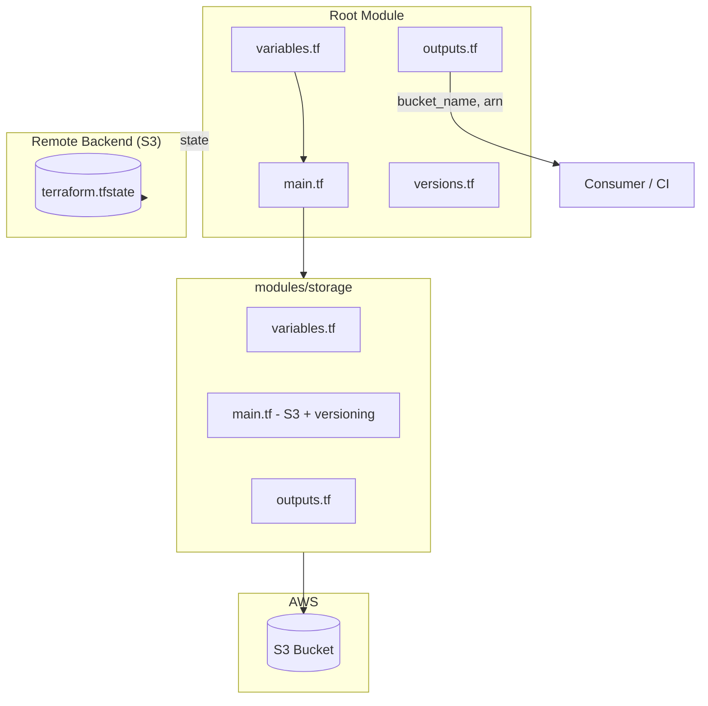

# Module 02: Terraform Fundamentals

Learn the core building blocks of Terraform by provisioning a real AWS resource: an S3 bucket with versioning enabled. You will practice variables, outputs, remote state backends, modules, and workspaces—the patterns used throughout this course.

---

## Learning Objectives

By the end of this module, you will be able to:

1. Configure the AWS provider with pinned versions.
2. Declare input variables with descriptions and validation rules.
3. Export useful values with outputs.
4. Explain Terraform state and why remote backends matter.
5. Configure an S3 backend (example) for team collaboration.
6. Create and consume a reusable Terraform module.
7. Use Terraform workspaces to manage multiple environments from one configuration.

---

## Theory

### Providers

A **provider** is a plugin that Terraform uses to interact with APIs. The `hashicorp/aws` provider translates HCL resources like `aws_s3_bucket` into AWS API calls.

Always pin provider versions in `versions.tf` to prevent surprise breaking changes:

```hcl
terraform {
  required_providers {
    aws = {
      source  = "hashicorp/aws"
      version = "~> 5.0"
    }
  }
}
```

### Variables

Variables parameterize your configuration. Production-quality variables include:

- `description` — documents purpose for teammates and CI
- `type` — constrains allowed values
- `validation` — rejects invalid input at plan time
- `default` — optional sensible default

### Outputs

Outputs expose values after `terraform apply`: bucket names, ARNs, endpoints. Other modules or humans can consume them via `terraform output` or remote state data sources.

### State

Terraform **state** (`terraform.tfstate`) maps resource addresses in HCL to real cloud resource IDs. Without state, Terraform cannot know what to update or destroy.

| State Type | Pros | Cons |
| --- | --- | --- |
| Local | Simple for learning | Not shareable, no locking |
| Remote (S3) | Team access, versioning | Requires bootstrap setup |

### Backend

A **backend** configures where state is stored. The S3 backend stores state in a bucket; DynamoDB (added in later modules) provides locking to prevent concurrent applies.

### Modules

A **module** is a container for multiple resources with a defined interface (`variables.tf` in, `outputs.tf` out). Modules enable reuse—the VPC module in Module 03 is consumed by the EKS module in Module 04.

### Workspaces

**Workspaces** let one root module manage multiple isolated state files (`dev`, `staging`, `prod`). Each workspace has its own `terraform.tfstate` without duplicating code.

---

## Architecture Diagram



---

## Folder Structure

```text
module-02-terraform/
├── README.md
├── EXERCISE.md
└── solution/
    ├── SOLUTION.md
    ├── .gitignore
    ├── versions.tf
    ├── variables.tf
    ├── outputs.tf
    ├── main.tf
    ├── backend.tf.example
    ├── terraform.tfvars.example
    └── modules/
        └── storage/
            ├── versions.tf
            ├── variables.tf
            ├── main.tf
            └── outputs.tf
```

---

## Prerequisites

- Completed [Module 01](../module-01-introduction/) toolchain setup.
- AWS credentials with S3 permissions (`s3:CreateBucket`, `s3:PutBucketVersioning`, etc.).
- Terraform >= 1.5 installed.

---

## Step-by-Step Instructions

### Step 1: Review the Solution Structure

```bash
cd module-02-terraform/solution
ls -la
```

Study how the root module calls `modules/storage`.

### Step 2: Configure Variables

```bash
cp terraform.tfvars.example terraform.tfvars
# Edit terraform.tfvars with your project name and environment
```

Never commit `terraform.tfvars` if it contains secrets (this example has none).

### Step 3: Initialize Terraform

```bash
terraform init
```

For local state (learning), skip backend configuration. For remote state:

```bash
cp backend.tf.example backend.tf
# Edit bucket name and region, then:
terraform init -migrate-state
```

### Step 4: Plan and Apply

```bash
terraform plan
terraform apply
```

Review the plan carefully. Confirm only expected resources will be created.

### Step 5: Inspect Outputs

```bash
terraform output
terraform output -json
```

### Step 6: Experiment with Workspaces

```bash
terraform workspace new dev
terraform apply -var="environment=dev"

terraform workspace new staging
terraform apply -var="environment=staging"

terraform workspace list
```

### Step 7: Complete the Exercise

Work through `EXERCISE.md` independently, then compare with `solution/`.

---

## Expected Output

```text
$ terraform apply
...
Apply complete! Resources: 3 added, 0 changed, 0 destroyed.

Outputs:

bucket_arn = "arn:aws:s3:::myproject-dev-tf-state-abc123"
bucket_id = "myproject-dev-tf-state-abc123"
bucket_region = "us-east-1"
versioning_status = "Enabled"
```

In AWS Console → S3, you should see a bucket with **Versioning: Enabled**.

---

## Verification Steps

1. `terraform validate` reports success.
2. `terraform plan` shows no unexpected changes after apply.
3. `aws s3api get-bucket-versioning --bucket <bucket_id>` returns `"Status": "Enabled"`.
4. Bucket tags include `Environment`, `Project`, and `ManagedBy`.
5. `terraform workspace show` reflects the active workspace.
6. `terraform output bucket_arn` returns a valid ARN.

---

## Common Mistakes

| Mistake | Consequence | Fix |
| --- | --- | --- |
| Globally unique bucket name collision | `BucketAlreadyExists` | Add random suffix or use `bucket_prefix` |
| Missing `terraform init` after adding backend | Init errors | Run `terraform init -reconfigure` |
| Committing `terraform.tfstate` | Leaks infrastructure details | Add to `.gitignore` |
| No provider version pin | Drift across machines | Pin in `versions.tf` |
| Applying in wrong workspace | Wrong environment resources | `terraform workspace select` before apply |
| Skipping `terraform plan` | Unintended destroys | Always plan in CI and locally |

---

## Troubleshooting

### `Error: creating S3 Bucket ... BucketAlreadyExists`

S3 bucket names are globally unique. Change `project_name` or add a random suffix.

### `Error: No valid credential sources found`

Run `aws configure` or `aws sso login`.

### Backend bucket does not exist

Bootstrap problem: create the state bucket manually once, or use local state for this module.

### `terraform init` provider checksum errors

Clear plugin cache: `rm -rf .terraform && terraform init`.

---

## Cleanup Steps

```bash
# Empty bucket first (versioned objects need all versions deleted)
aws s3 rm s3://<bucket_id> --recursive

# Or use terraform destroy
terraform destroy
```

Repeat for each workspace if you created multiple. Verify the bucket is gone in the AWS Console.

---

## Summary

You learned Terraform's essential primitives: providers, variables, outputs, state, backends, modules, and workspaces. The storage module pattern—clear inputs, tagged resources, explicit outputs—is repeated at larger scale for VPC and EKS in upcoming modules.

**Next:** [Module 03 — AWS Networking](../module-03-networking/)

---

## Quiz

1. **What happens if you delete `terraform.tfstate` but leave real AWS resources running?**

2. **Why pin provider versions with `~> 5.0` instead of using the latest implicitly?**

3. **What is the difference between a root module and a child module?**

4. **When would you choose Terraform workspaces over separate root directories per environment?**

5. **Name three tags this course requires on every AWS resource and explain why tagging matters.**

---

### Quiz Answer Key (self-check)

1. Terraform loses track of resources; the next apply may try to recreate them or fail due to name conflicts.
2. Minor version flexibility with upper bound protection against breaking major upgrades.
3. Root module is the entry point (`terraform apply`); child modules are reusable components called by the root.
4. Workspaces suit similar infra across envs with isolated state; separate dirs suit divergent configurations.
5. `Environment`, `Project`, `ManagedBy` — enable cost allocation, ownership, and automation filtering.
