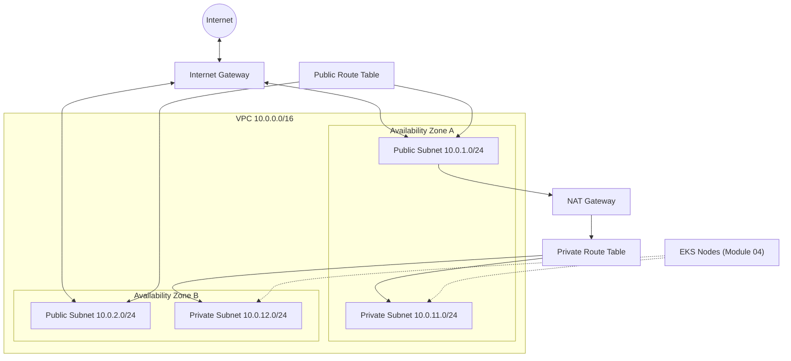

# Module 03: AWS Networking with Terraform

Build a production-style VPC with public and private subnets across two Availability Zones, including Internet Gateway, NAT Gateway, and route tables. This networking foundation is required before deploying Amazon EKS in Module 04.

---

## Learning Objectives

By the end of this module, you will be able to:

1. Explain VPC CIDR planning and subnet sizing for EKS workloads.
2. Create public subnets for load balancers and NAT Gateways.
3. Create private subnets for EKS worker nodes and application pods.
4. Configure an Internet Gateway for public internet access.
5. Deploy NAT Gateway(s) so private resources can reach the internet outbound.
6. Associate route tables correctly with each subnet tier.
7. Package networking as a reusable Terraform module with a clear interface.

---

## Theory

### VPC (Virtual Private Cloud)

A **VPC** is your isolated network boundary in AWS. You define a CIDR block (e.g., `10.0.0.0/16`) and subdivide it into subnets.

### Public vs. Private Subnets

| Subnet Type | Route to Internet | Typical Workloads |
| --- | --- | --- |
| **Public** | `0.0.0.0/0` → Internet Gateway | NAT Gateway, public ALB/NLB |
| **Private** | `0.0.0.0/0` → NAT Gateway | EKS nodes, databases, internal services |

A subnet is **public** when its route table has a route to an Internet Gateway (IGW). It is **private** when outbound internet goes through a NAT Gateway instead.

### Internet Gateway (IGW)

An **Internet Gateway** allows bidirectional internet access for resources with public IPs in public subnets.

### NAT Gateway

A **NAT Gateway** lives in a public subnet and enables **outbound-only** internet access for private subnets. EKS nodes in private subnets pull container images through NAT.

**Cost note:** One NAT Gateway per AZ is highly available but costs ~$0.045/hr each. This course uses a **single NAT Gateway** in the first public subnet to reduce learning costs.

### Route Tables

Each subnet associates with exactly one route table. You typically need:

- One public route table (shared across public subnets)
- One private route table per NAT path (one shared private RT when using single NAT)

### EKS Networking Requirements

EKS requires:

- Subnets in **at least two AZs**
- Tags on subnets for load balancer discovery (`kubernetes.io/role/elb` and `kubernetes.io/role/internal-elb`)
- Sufficient IP space for nodes and pods

---

## Architecture Diagram



---

## Folder Structure

```text
module-03-networking/
├── README.md
├── EXERCISE.md
└── solution/
    ├── SOLUTION.md
    ├── .gitignore
    ├── main.tf              # Example root calling the VPC module
    ├── variables.tf
    ├── outputs.tf
    ├── versions.tf
    ├── terraform.tfvars.example
    └── modules/
        └── vpc/
            ├── main.tf
            ├── variables.tf
            ├── outputs.tf
            └── versions.tf
```

---

## Prerequisites

- Completed [Module 02](../module-02-terraform/).
- AWS credentials with EC2 and VPC permissions.
- Terraform >= 1.5, AWS provider ~> 5.0.

---

## Step-by-Step Instructions

### Step 1: Review the VPC Module Interface

```bash
cd module-03-networking/solution
cat modules/vpc/variables.tf
cat modules/vpc/outputs.tf
```

Understand inputs (`vpc_cidr`, `azs`, subnet CIDRs) and outputs (`vpc_id`, `private_subnet_ids`).

### Step 2: Configure Variables

```bash
cp terraform.tfvars.example terraform.tfvars
# Adjust project_name and environment
```

### Step 3: Initialize and Plan

```bash
terraform init
terraform plan
```

Expect approximately 15–20 resources: VPC, subnets, IGW, NAT, EIPs, route tables, associations.

### Step 4: Apply

```bash
terraform apply
```

Takes 2–4 minutes (NAT Gateway creation is slow).

### Step 5: Verify in AWS Console

VPC → Your VPCs → select VPC → Resource map. Confirm 2 public + 2 private subnets across 2 AZs.

### Step 6: Verify with AWS CLI

```bash
terraform output vpc_id
aws ec2 describe-subnets --filters "Name=vpc-id,Values=<vpc_id>" \
  --query 'Subnets[].{ID:SubnetId,CIDR:CidrBlock,AZ:AvailabilityZone,Public:MapPublicIpOnLaunch}' \
  --output table
```

### Step 7: Complete the Exercise

Follow `EXERCISE.md` before reviewing `solution/SOLUTION.md`.

---

## Expected Output

```text
Apply complete! Resources: 18 added, 0 changed, 0 destroyed.

Outputs:

nat_gateway_public_ip = "54.123.45.67"
private_subnet_ids = [
  "subnet-0aaa...",
  "subnet-0bbb...",
]
public_subnet_ids = [
  "subnet-0ccc...",
  "subnet-0ddd...",
]
vpc_cidr_block = "10.0.0.0/16"
vpc_id = "vpc-0abc..."
```

---

## Verification Steps

1. VPC exists with CIDR `10.0.0.0/16` (or your configured value).
2. Four subnets across two AZs with correct CIDRs.
3. Public subnets have `map_public_ip_on_launch = true`.
4. Internet Gateway attached to VPC.
5. NAT Gateway in a public subnet, state `available`.
6. Private route table has `0.0.0.0/0` → NAT Gateway.
7. Public route table has `0.0.0.0/0` → Internet Gateway.
8. All resources tagged with `Environment`, `Project`, `ManagedBy`.
9. EKS discovery tags present on subnets.

---

## Common Mistakes

| Mistake | Symptom | Fix |
| --- | --- | --- |
| Overlapping CIDRs | Apply fails or routing breaks | Plan IP space; use `/24` per subnet |
| NAT in private subnet | NAT never becomes available | NAT must be in public subnet |
| Missing IGW attachment | Public instances cannot reach internet | `aws_internet_gateway_attachment` |
| Single AZ only | EKS creation fails | Use minimum 2 AZs |
| Wrong route table association | Subnet behaves as wrong tier | Check `aws_route_table_association` |
| Forgetting EKS subnet tags | Load balancers fail to provision | Add `kubernetes.io/role/*` tags |

---

## Troubleshooting

### NAT Gateway stuck in `pending`

Wait up to 5 minutes. Verify Elastic IP is allocated and subnet is public.

### `Error: creating EC2 VPC: VpcLimitExceeded`

Request a limit increase or delete unused VPCs.

### Subnets in same AZ

Ensure `availability_zones` lists two distinct AZs for the region.

### Terraform wants to replace NAT on re-apply

Avoid changing subnet AZ mapping after apply; replacement is expensive.

---

## Cleanup Steps

```bash
terraform destroy
```

NAT Gateway and Elastic IP are the main cost drivers—destroy promptly. Verify in Console that VPC and subnets are gone.

---

## Summary

You built a multi-AZ VPC suitable for EKS: public subnets for ingress and NAT, private subnets for worker nodes, and correct routing via IGW and NAT. The module interface exports IDs the EKS module consumes in Module 04.

**Next:** [Module 04 — Amazon EKS](../module-04-eks/)

---

## Quiz

1. **Why do private subnets need a NAT Gateway for EKS nodes?**

2. **What makes a subnet "public" in AWS terms?**

3. **Why does EKS require subnets in at least two Availability Zones?**

4. **What is the cost trade-off between one NAT Gateway vs. one per AZ?**

5. **Which subnet tags does AWS load balancer controller use to discover subnets?**

---

### Quiz Answer Key (self-check)

1. Nodes pull images and patches from the internet; private subnets have no direct IGW route.
2. Its route table has a route to an Internet Gateway for `0.0.0.0/0`.
3. Control plane and managed services require multi-AZ redundancy for HA.
4. Single NAT is cheaper but creates cross-AZ traffic and an AZ single point of failure.
5. `kubernetes.io/role/elb` (public) and `kubernetes.io/role/internal-elb` (private).
