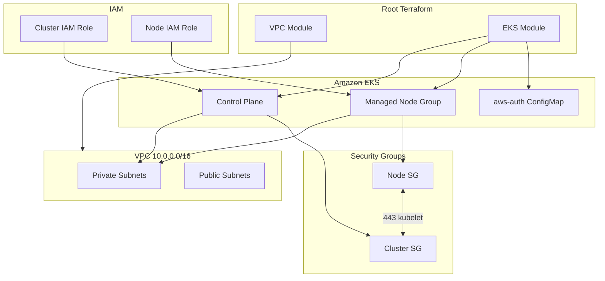

# Module 04: Provision Amazon EKS with Terraform

Deploy a production-style Amazon EKS cluster with managed node groups, IAM roles, security groups, and `aws-auth` ConfigMap management—built on the VPC module from Module 03.

---

## Learning Objectives

By the end of this module, you will be able to:

1. Provision an EKS control plane with Terraform.
2. Attach IAM roles for the cluster and worker nodes with least-privilege policies.
3. Deploy a managed node group in private subnets.
4. Configure security groups for cluster-to-node communication.
5. Manage the `aws-auth` ConfigMap to map IAM roles to Kubernetes RBAC.
6. Configure `kubectl` using Terraform outputs.
7. Compose VPC and EKS modules into a single root configuration.

---

## Theory

### EKS Control Plane

AWS hosts the Kubernetes API server, etcd, and scheduler. You pay ~$0.10/hour per cluster. The control plane ENIs are placed in your VPC subnets (private by default in recent EKS versions).

### Managed Node Groups

**Managed node groups** let AWS handle EC2 lifecycle for workers: AMI updates, draining, and scaling. Nodes join the cluster via an IAM instance profile.

### IAM Roles for EKS

| Role | Trust | Policies |
| --- | --- | --- |
| **Cluster role** | `eks.amazonaws.com` | `AmazonEKSClusterPolicy` |
| **Node role** | `ec2.amazonaws.com` | `AmazonEKSWorkerNodePolicy`, `AmazonEKS_CNI_Policy`, `AmazonEC2ContainerRegistryReadOnly` |

### Security Groups

EKS creates a **cluster security group** automatically. You typically add a **node security group** allowing:

- Nodes → cluster API (port 443)
- Cluster → nodes (kubelet, ephemeral ports)
- Node-to-node communication within the group

### aws-auth ConfigMap

The `aws-auth` ConfigMap in `kube-system` maps AWS IAM principals to Kubernetes users and groups. Without it, nodes cannot join the cluster and IAM users cannot authenticate via `kubectl`.

**Note:** EKS Access Entries (newer API) may supplement or replace `aws-auth` in future AWS versions. This module uses the ConfigMap approach for broad compatibility and learning.

### Module Composition

```
Root Module
├── module.vpc      (Module 03)
└── module.eks      (uses vpc outputs)
```

---

## Architecture Diagram



---

## Folder Structure

```text
module-04-eks/
├── README.md
├── EXERCISE.md
└── solution/
    ├── SOLUTION.md
    ├── .gitignore
    ├── versions.tf
    ├── variables.tf
    ├── outputs.tf
    ├── main.tf
    ├── terraform.tfvars.example
    └── modules/
        ├── vpc/          # From Module 03
        └── eks/
            ├── versions.tf
            ├── variables.tf
            ├── main.tf
            ├── iam.tf
            ├── security_groups.tf
            ├── aws_auth.tf
            └── outputs.tf
```

---

## Prerequisites

- Completed [Module 03](../module-03-networking/) or use the bundled VPC module.
- AWS credentials with EKS, EC2, IAM permissions.
- `kubectl` installed (Module 01).
- Terraform >= 1.5, AWS provider ~> 5.0.

---

## Step-by-Step Instructions

### Step 1: Review Configuration

```bash
cd module-04-eks/solution
cp terraform.tfvars.example terraform.tfvars
```

Adjust `project_name`, `environment`, and `kubernetes_version` if needed.

### Step 2: Initialize

```bash
terraform init
```

### Step 3: Plan (expect 25–35 resources)

```bash
terraform plan -out=tfplan
```

Review IAM roles, EKS cluster, node group, and security groups.

### Step 4: Apply (10–15 minutes)

```bash
terraform apply tfplan
```

EKS cluster creation is slow—do not interrupt.

### Step 5: Configure kubectl

```bash
aws eks update-kubeconfig \
  --region us-east-1 \
  --name $(terraform output -raw cluster_name)
```

### Step 6: Verify Cluster

```bash
kubectl get nodes
kubectl get pods -A
kubectl get configmap aws-auth -n kube-system
```

### Step 7: Complete Exercise

Work through `EXERCISE.md` independently.

---

## Expected Output

```text
Apply complete! Resources: 32 added, 0 changed, 0 destroyed.

Outputs:

cluster_arn = "arn:aws:eks:us-east-1:123456789012:cluster/gha-eks-course-dev-eks"
cluster_endpoint = "https://ABC.gr7.us-east-1.eks.amazonaws.com"
cluster_name = "gha-eks-course-dev-eks"
cluster_version = "1.29"
node_group_arn = "arn:aws:eks:..."
configure_kubectl = "aws eks update-kubeconfig --region us-east-1 --name gha-eks-course-dev-eks"
```

```text
$ kubectl get nodes
NAME                          STATUS   ROLES    AGE   VERSION
ip-10-0-11-42.ec2.internal    Ready    <none>   5m    v1.29.x
ip-10-0-12-103.ec2.internal   Ready    <none>   5m    v1.29.x
```

---

## Verification Steps

1. EKS cluster status is `ACTIVE` in AWS Console.
2. Managed node group status is `ACTIVE` with desired capacity met.
3. `kubectl get nodes` shows Ready nodes in private subnets.
4. `aws-auth` ConfigMap contains node role mapping.
5. Cluster and nodes have required tags.
6. `terraform output cluster_endpoint` returns HTTPS URL.

---

## Common Mistakes

| Mistake | Symptom | Fix |
| --- | --- | --- |
| Subnets without EKS tags | Nodes fail to register | Apply Module 03 subnet tags |
| Wrong IAM policies on node role | Nodes NotReady | Attach required EKS policies |
| Missing aws-auth entry | Nodes cannot join | Map node role in ConfigMap |
| Public-only subnets for nodes | Security exposure | Use private subnets |
| Too-small instance types | Pods pending / OOM | Use at least `t3.medium` for learning |
| Skipping `update-kubeconfig` | kubectl connection refused | Run output command |

---

## Troubleshooting

### Nodes stuck `NotReady`

```bash
kubectl describe node <name>
aws eks describe-nodegroup --cluster-name <cluster> --nodegroup-name <ng>
```

Check node IAM role and security groups.

### `error: You must be logged in to the cluster`

```bash
aws eks update-kubeconfig --name <cluster> --region us-east-1
aws sts get-caller-identity
```

Ensure your IAM user/role is in `aws-auth` if not using the same role that created the cluster.

### Terraform fails on aws-auth

Cluster must be `ACTIVE` before ConfigMap apply. The module uses `depends_on`—re-run `terraform apply` if timing issue.

### EKS version unsupported

Check [EKS version support](https://docs.aws.amazon.com/eks/latest/userguide/kubernetes-versions.html) and update `kubernetes_version`.

---

## Cleanup Steps

```bash
# Delete load balancer services first if any were created
terraform destroy
```

EKS destroy order: node group → cluster → IAM (Terraform handles dependencies). Verify no orphaned EC2 instances or EBS volumes in Console.

**Cost reminder:** EKS control plane bills hourly even with zero nodes.

---

## Summary

You composed VPC and EKS modules into a working cluster: IAM roles establish trust, managed node groups run workloads in private subnets, security groups control traffic, and `aws-auth` bridges AWS IAM to Kubernetes RBAC. This cluster is the deployment target for Modules 05–08.

**Next:** [Module 05 — Deploy Sample App](../module-05-kubernetes/)

---

## Quiz

1. **What IAM policies must be attached to the EKS node role?**

2. **Why are worker nodes placed in private subnets?**

3. **What does the aws-auth ConfigMap do?**

4. **What is the difference between the cluster IAM role and the node IAM role?**

5. **Why does EKS cluster creation take 10–15 minutes?**

---

### Quiz Answer Key (self-check)

1. `AmazonEKSWorkerNodePolicy`, `AmazonEKS_CNI_Policy`, `AmazonEC2ContainerRegistryReadOnly` (plus others for add-ons).
2. Reduces attack surface; outbound via NAT, ingress via load balancers.
3. Maps IAM ARNs to Kubernetes usernames/groups for authentication and node bootstrap.
4. Cluster role is assumed by EKS control plane; node role is assumed by EC2 worker instances.
5. AWS provisions control plane ENIs, certificates, and etcd across AZs.
