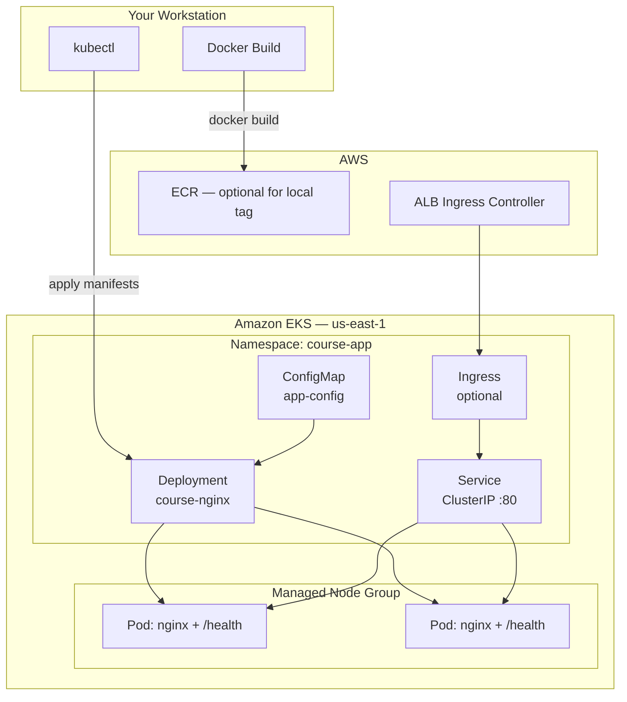

# Module 05 — Deploy Sample Application to EKS

Deploy a containerized sample application to the Amazon EKS cluster you provisioned in Module 04 using Kubernetes manifests, `kubectl`, and production-oriented patterns.

**Region:** `us-east-1`  
**Estimated time:** 2–3 hours

---

## Learning Objectives

By the end of this module you will be able to:

1. Explain core Kubernetes objects: **Namespace**, **Deployment**, **Service**, **ConfigMap**, and **Ingress**.
2. Write declarative manifests with resource requests, limits, probes, and labels.
3. Build a container image with a **health endpoint** suitable for liveness and readiness checks.
4. Configure `kubectl` to authenticate against an EKS cluster using the AWS CLI.
5. Apply manifests with `kubectl apply` and verify workload health.
6. Troubleshoot common deployment failures (image pull errors, probe failures, scheduling issues).

---

## Theory

### Kubernetes on EKS

Amazon EKS runs the Kubernetes control plane in AWS-managed infrastructure. You interact with the API server using `kubectl` or CI/CD tools. Workloads run on **worker nodes** (managed node groups from Module 04).

### Key Objects

| Object | Purpose |
| --- | --- |
| **Namespace** | Logical isolation for resources (e.g., `course-app`) |
| **Deployment** | Declarative desired state for Pods; handles rolling updates |
| **Service** | Stable network endpoint (ClusterIP, NodePort, LoadBalancer) |
| **ConfigMap** | Non-sensitive configuration injected as env vars or files |
| **Ingress** | HTTP/HTTPS routing to Services (requires an Ingress controller) |

### Health Probes

Production deployments should define:

- **Liveness probe** — restarts the container if the app is deadlocked.
- **Readiness probe** — removes the Pod from Service endpoints until ready.

A dedicated `/health` endpoint returning HTTP 200 is a common pattern.

### Labels and Selectors

Labels (`app: course-nginx`) connect Deployments to Services via `selector` fields. Consistent labeling enables filtering, monitoring, and GitOps.

### Image Pull Policy

Use `imagePullPolicy: IfNotPresent` for local/minikube testing and `Always` in CI/CD when tags are reused (prefer immutable tags like Git SHA).

---

## Architecture Diagram



---

## Folder Structure

```text
module-05-kubernetes/
├── README.md              # This guide
├── EXERCISE.md            # Hands-on tasks (no solution)
└── solution/
    ├── SOLUTION.md        # Line-by-line explanation
    ├── Dockerfile         # Custom nginx with /health
    └── k8s/
        ├── namespace.yaml
        ├── configmap.yaml
        ├── deployment.yaml
        ├── service.yaml
        └── ingress.yaml   # Optional — requires ALB controller
```

---

## Prerequisites

| Requirement | Notes |
| --- | --- |
| Module 04 complete | EKS cluster and node group running in `us-east-1` |
| `kubectl` 1.28+ | `kubectl version --client` |
| `aws` CLI v2 | `aws sts get-caller-identity` succeeds |
| Docker 24+ | For building the sample image locally |
| IAM permissions | `eks:DescribeCluster`, node group access |

### Configure kubectl for EKS

```bash
export AWS_REGION=us-east-1
export CLUSTER_NAME=course-eks   # match your Module 04 cluster name

aws eks update-kubeconfig \
  --region "$AWS_REGION" \
  --name "$CLUSTER_NAME"

kubectl get nodes
```

You should see nodes in `Ready` state.

---

## Step-by-Step Instructions

### Step 1 — Review the solution layout (or build your own)

```bash
cd module-05-kubernetes/solution
ls -la k8s/
```

### Step 2 — Build the container image

```bash
docker build -t course-nginx:local .
```

### Step 3 — Load image to cluster (local dev options)

**Option A — Push to ECR (recommended for EKS):**

```bash
AWS_ACCOUNT_ID=$(aws sts get-caller-identity --query Account --output text)
ECR_REPO=course-nginx

aws ecr describe-repositories --repository-names "$ECR_REPO" --region us-east-1 2>/dev/null \
  || aws ecr create-repository --repository-name "$ECR_REPO" --region us-east-1

aws ecr get-login-password --region us-east-1 \
  | docker login --username AWS --password-stdin "${AWS_ACCOUNT_ID}.dkr.ecr.us-east-1.amazonaws.com"

docker tag course-nginx:local "${AWS_ACCOUNT_ID}.dkr.ecr.us-east-1.amazonaws.com/${ECR_REPO}:v1"
docker push "${AWS_ACCOUNT_ID}.dkr.ecr.us-east-1.amazonaws.com/${ECR_REPO}:v1"
```

Update `deployment.yaml` `image:` field with your ECR URI.

**Option B — Kind/minikube:** load image directly (not covered here; EKS requires a registry).

### Step 4 — Apply Kubernetes manifests

Apply in dependency order:

```bash
kubectl apply -f k8s/namespace.yaml
kubectl apply -f k8s/configmap.yaml
kubectl apply -f k8s/deployment.yaml
kubectl apply -f k8s/service.yaml

# Optional — only if AWS Load Balancer Controller is installed
kubectl apply -f k8s/ingress.yaml
```

Or apply the directory:

```bash
kubectl apply -f k8s/ --recursive
```

### Step 5 — Wait for rollout

```bash
kubectl rollout status deployment/course-nginx -n course-app --timeout=120s
```

### Step 6 — Verify the application

```bash
# Port-forward to access ClusterIP Service locally
kubectl port-forward svc/course-nginx -n course-app 8080:80

# In another terminal
curl -s http://localhost:8080/health
curl -s http://localhost:8080/
```

### Step 7 — Inspect resources

```bash
kubectl get all -n course-app
kubectl describe deployment course-nginx -n course-app
kubectl logs -l app=course-nginx -n course-app --tail=20
```

---

## Expected Output

```text
$ kubectl get pods -n course-app
NAME                            READY   STATUS    RESTARTS   AGE
course-nginx-xxxxxxxxxx-xxxxx   1/1     Running   0          45s
course-nginx-xxxxxxxxxx-xxxxx   1/1     Running   0          45s

$ curl -s http://localhost:8080/health
{"status":"healthy","service":"course-nginx"}

$ kubectl get svc -n course-app
NAME           TYPE        CLUSTER-IP      EXTERNAL-IP   PORT(S)   AGE
course-nginx   ClusterIP   10.100.xxx.xx   <none>        80/TCP    1m
```

---

## Verification Steps

1. **Nodes ready:** `kubectl get nodes` — all `Ready`.
2. **Pods running:** `kubectl get pods -n course-app` — `2/2` or `1/1` READY, `Running`.
3. **Health endpoint:** `curl` returns HTTP 200 with JSON body.
4. **Probes passing:** `kubectl describe pod -n course-app` — no `Unhealthy` events.
5. **ConfigMap mounted:** logs or env show `APP_ENV` from ConfigMap.
6. **Service endpoints:** `kubectl get endpoints course-nginx -n course-app` lists Pod IPs.

---

## Common Mistakes

| Mistake | Symptom | Fix |
| --- | --- | --- |
| Wrong kubeconfig context | `connection refused` or wrong cluster | `aws eks update-kubeconfig` with correct cluster name |
| Image not in ECR | `ImagePullBackOff` | Push image; verify URI and IAM/node instance role for ECR |
| Missing namespace | resources in `default` or not found | Apply `namespace.yaml` first; use `-n course-app` |
| Probe too aggressive | CrashLoopBackOff | Increase `initialDelaySeconds`; verify `/health` path |
| Selector mismatch | Service has no endpoints | Align Deployment labels with Service `selector` |
| Insufficient resources | Pods `Pending` | Check `kubectl describe pod` for CPU/memory requests |

---

## Troubleshooting

### ImagePullBackOff

```bash
kubectl describe pod -n course-app -l app=course-nginx | grep -A5 Events
```

Verify ECR repository exists, image tag is correct, and node IAM role has `AmazonEC2ContainerRegistryReadOnly`.

### CrashLoopBackOff

```bash
kubectl logs -n course-app -l app=course-nginx --previous
```

Check nginx config syntax and probe paths.

### Pods Pending

```bash
kubectl describe pod -n course-app <pod-name>
```

Look for `Insufficient cpu` or taints. Reduce requests or scale node group.

### Cannot connect via port-forward

Ensure the Pod is `Running` and readiness probe passes:

```bash
kubectl get pods -n course-app -o wide
```

---

## Cleanup Steps

Remove application resources (keeps the EKS cluster from Module 04):

```bash
kubectl delete -f k8s/ --ignore-not-found
# Or delete the whole namespace
kubectl delete namespace course-app --ignore-not-found
```

Optional — delete ECR images:

```bash
aws ecr delete-repository --repository-name course-nginx --force --region us-east-1
```

---

## Summary

You deployed a sample nginx application to EKS using declarative Kubernetes manifests. You configured health probes, resource limits, a ConfigMap, and a ClusterIP Service. This foundation prepares you for GitHub Actions CI (Module 07) and CD (Module 08), where the same manifests will be applied automatically on every release.

---

## Quiz

1. What is the difference between a **liveness** probe and a **readiness** probe?
2. Why should Deployments and Services use matching **labels** and **selectors**?
3. What command updates your local kubeconfig to talk to an EKS cluster in `us-east-1`?
4. What Kubernetes object provides non-sensitive key-value configuration to Pods?
5. Why does EKS typically require pushing images to **ECR** instead of using only local Docker tags?

### Answer Key

1. Liveness restarts unhealthy containers; readiness controls traffic routing to Pods.
2. The Service must select the same Pod labels the Deployment template uses to route traffic correctly.
3. `aws eks update-kubeconfig --region us-east-1 --name <cluster-name>`
4. ConfigMap
5. EKS nodes pull images from a registry; local-only tags are not available on worker nodes.
