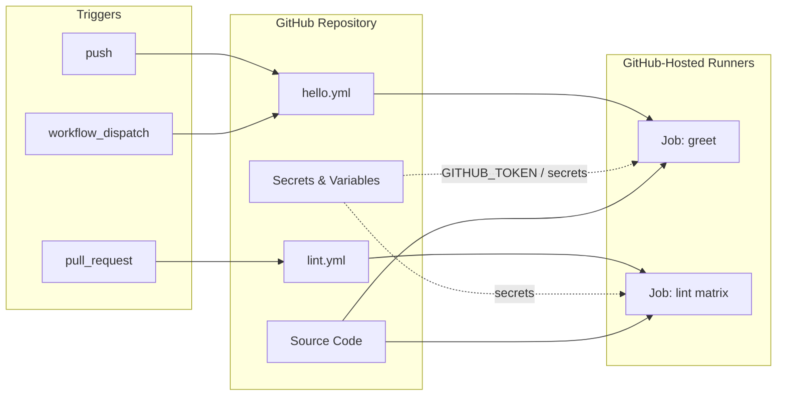

# Module 06 — GitHub Actions Fundamentals

Learn GitHub Actions workflow syntax: triggers, jobs, steps, matrices, secrets, and environment variables — the building blocks for CI/CD in Modules 07 and 08.

**Region:** `us-east-1` (AWS workflows in later modules)  
**Estimated time:** 2–3 hours

---

## Learning Objectives

By the end of this module you will be able to:

1. Describe GitHub Actions architecture: workflows, events, jobs, steps, runners, and actions.
2. Write workflow YAML with `on`, `jobs`, `runs-on`, `steps`, and `uses`/`run`.
3. Configure **workflow triggers** (`push`, `pull_request`, `workflow_dispatch`, schedules).
4. Use **matrix builds** to test across multiple versions or platforms.
5. Store and reference **secrets** and **variables** safely.
6. Apply **permissions**, **concurrency**, and job dependencies (`needs`).

---

## Theory

### GitHub Actions Overview

GitHub Actions automates software workflows in response to repository events. Workflows are YAML files in `.github/workflows/`.

| Concept | Description |
| --- | --- |
| **Workflow** | Automated procedure defined in YAML |
| **Event** | Trigger (push, PR, schedule, manual) |
| **Job** | Set of steps that run on the same runner |
| **Step** | Single task — run a script or use an action |
| **Action** | Reusable unit (checkout, setup-node, etc.) |
| **Runner** | VM that executes jobs (`ubuntu-latest`, self-hosted) |

### Workflow Structure

```yaml
name: Example
on: [push]
jobs:
  build:
    runs-on: ubuntu-latest
    steps:
      - uses: actions/checkout@v4
      - run: echo "Hello"
```

### Triggers (`on`)

- **`push`** / **`pull_request`** — most common for CI
- **`workflow_dispatch`** — manual runs from the Actions tab
- **`schedule`** — cron-based (use UTC)
- **Path filters** — run only when certain files change

### Secrets vs Variables

| Type | Visibility | Use case |
| --- | --- | --- |
| **Secrets** | Encrypted, masked in logs | AWS keys, tokens (avoid when OIDC is available) |
| **Variables** | Plain text, repo/org/environment level | Region names, non-sensitive config |
| **Environments** | Optional protection rules + secrets | staging/prod approval gates (Module 10) |

**Never** print secrets in logs. Prefer **OIDC** for AWS in Module 07 over long-lived access keys.

### Matrix Strategy

Run the same job across multiple configurations:

```yaml
strategy:
  matrix:
    node-version: [18, 20, 22]
```

GitHub creates one job per matrix combination (subject to plan limits).

### Permissions (Least Privilege)

```yaml
permissions:
  contents: read
```

Grant only what the workflow needs — especially important before AWS OIDC in Module 07.

---

## Architecture Diagram



---

## Folder Structure

```text
module-06-github-actions/
├── README.md
├── EXERCISE.md
└── solution/
    ├── SOLUTION.md
    └── .github/
        └── workflows/
            ├── hello.yml    # Triggers, jobs, steps, env, secrets pattern
            └── lint.yml     # Matrix, PR triggers, permissions
```

---

## Prerequisites

| Requirement | Notes |
| --- | --- |
| GitHub account | Free tier supports Actions minutes |
| Git installed | Local clone and push |
| Repository | Fork or create `github-actions-terraform-eks-course` on GitHub |
| Module 05 | Not strictly required; no AWS needed for this module |

### Enable Actions

Repository → **Settings** → **Actions** → **General** → Allow actions.

---

## Step-by-Step Instructions

### Step 1 — Copy solution workflows to your repo

```bash
cd module-06-github-actions/solution
cp -r .github /path/to/your/github/repo/
```

Or create files manually following `EXERCISE.md`.

### Step 2 — Commit and push

```bash
git add .github/workflows/
git commit -m "Add GitHub Actions fundamentals workflows"
git push origin main
```

### Step 3 — Run hello workflow manually

1. Open GitHub → **Actions** tab
2. Select **Hello Workflow**
3. Click **Run workflow** → choose branch → **Run workflow**

### Step 4 — Trigger lint workflow

```bash
# Make a small change and open a PR, or push to a feature branch
echo "# test" >> README.md
git checkout -b feature/test-actions
git add README.md
git commit -m "Trigger lint workflow"
git push -u origin feature/test-actions
```

Open a pull request against `main` and watch **Lint Workflow** run.

### Step 5 — Configure a repository secret (practice)

1. **Settings** → **Secrets and variables** → **Actions** → **New repository secret**
2. Name: `COURSE_GREETING_NAME`, Value: `your-name`
3. Re-run **Hello Workflow** (manual dispatch with input or default)

### Step 6 — Add a repository variable

1. **Settings** → **Secrets and variables** → **Actions** → **Variables** tab
2. Name: `AWS_REGION`, Value: `us-east-1`
3. The hello workflow reads `vars.AWS_REGION` when configured

### Step 7 — Review workflow logs

Click into each job → expand steps → note how secrets are masked (`***`).

---

## Expected Output

**Hello Workflow — successful run:**

```text
Run echo "Hello, GitHub Actions!"
Hello, GitHub Actions!

Run echo "Greeting target: ***"
Greeting target: ***

Run echo "Region: us-east-1"
Region: us-east-1
```

**Lint Workflow — matrix (3 jobs):**

```text
✓ lint (ubuntu-latest, 18)
✓ lint (ubuntu-latest, 20)
✓ lint (ubuntu-latest, 22)
```

---

## Verification Steps

1. **Actions tab** shows both workflows listed.
2. **Hello Workflow** completes green on `workflow_dispatch`.
3. **Lint Workflow** runs on pull request with three matrix jobs.
4. Secret values never appear in plaintext in logs.
5. `permissions: contents: read` is set on lint workflow (inspect YAML).
6. Workflow files pass YAML syntax (no red X on parse errors).

---

## Common Mistakes

| Mistake | Symptom | Fix |
| --- | --- | --- |
| Wrong workflow path | Workflow not listed | Files must be `.github/workflows/*.yml` |
| Invalid YAML indentation | Workflow fails to load | Use 2 spaces; validate with `actionlint` |
| Secret not defined | Empty or failed step | Add secret under repo Settings |
| Missing `actions/checkout` | Commands can't find files | First step: `uses: actions/checkout@v4` |
| Matrix typo | Jobs skipped or failed | Quote versions: `"20"` not bare numbers if needed |
| `GITHUB_TOKEN` over-permissioned | Security risk | Set explicit `permissions:` block |

---

## Troubleshooting

### Workflow does not appear

- Confirm file is on default branch or the branch you select for manual run.
- Check Actions are enabled for the repository.

### Permission denied on push

```text
refusing to allow an OAuth App to create or update workflow
```

Ensure your token/user has `workflow` scope or write access to the repo.

### Matrix job fails on one version

Inspect that job's log — often a version-specific tool issue. Pin action versions (`@v4`).

### Secret shows empty

Secrets are not passed to workflows from forked PRs (security). Test on branches in the same repo.

---

## Cleanup Steps

Optional — remove practice workflows:

```bash
git rm .github/workflows/hello.yml .github/workflows/lint.yml
git commit -m "Remove module 06 practice workflows"
git push
```

Delete test secrets/variables in GitHub Settings if no longer needed.

---

## Summary

You learned GitHub Actions fundamentals: event triggers, job graphs, reusable actions, matrix builds, and secure handling of secrets and variables. Module 07 extends these patterns to build, test, and push Docker images to Amazon ECR; Module 08 deploys to EKS.

---

## Quiz

1. Where must workflow YAML files live in a GitHub repository?
2. What is the difference between `run:` and `uses:` in a step?
3. Why are secrets not available to workflows triggered from **fork** pull requests?
4. What does `strategy.matrix` accomplish?
5. What is the recommended alternative to storing long-lived `AWS_ACCESS_KEY_ID` in GitHub Secrets?

### Answer Key

1. `.github/workflows/` (`.yml` or `.yaml`)
2. `run` executes shell commands; `uses` invokes a GitHub Action or reusable workflow
3. Prevents untrusted code from exfiltrating secrets via malicious PR workflows
4. Runs parallel job variants across dimensions (OS, language version, etc.)
5. OpenID Connect (OIDC) federation with short-lived AWS credentials
