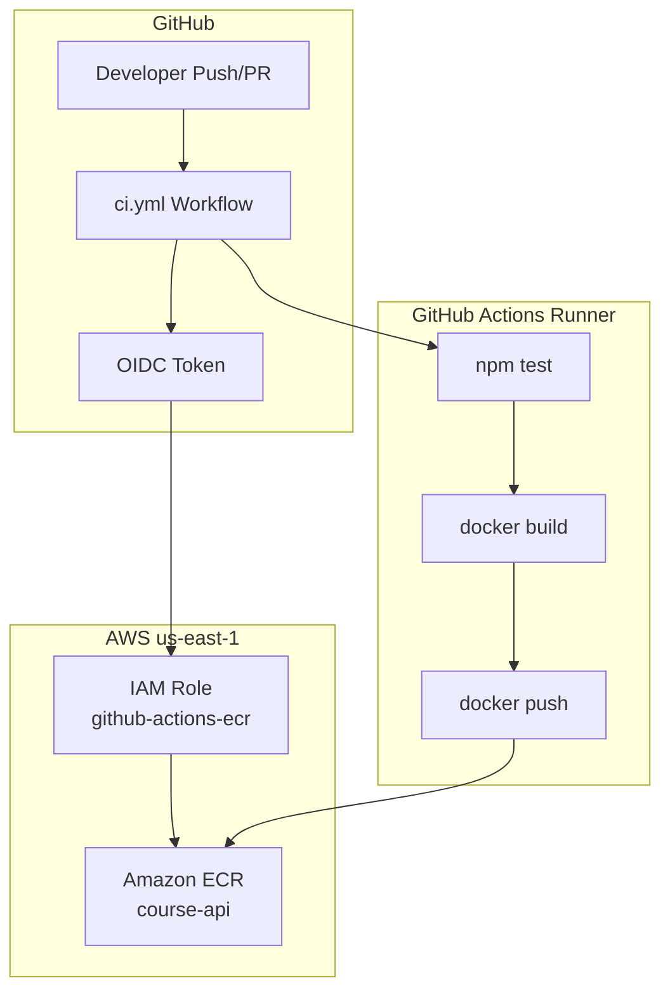

# Module 07 — CI Pipeline: Build, Test, Docker Build, Push to Amazon ECR

Build a complete **continuous integration** pipeline with GitHub Actions that tests a Node.js application, builds a Docker image, and pushes it to **Amazon ECR** in `us-east-1` using **OIDC** (preferred) or access keys (documented alternative).

**Region:** `us-east-1`  
**Estimated time:** 3–4 hours

---

## Learning Objectives

By the end of this module you will be able to:

1. Structure a small application with automated **unit tests**.
2. Write a production-oriented **Dockerfile** (multi-stage, non-root user).
3. Configure **Amazon ECR** and push immutable image tags.
4. Authenticate GitHub Actions to AWS using **OIDC** (no long-lived keys).
5. Implement a **CI workflow**: test → build → push to ECR.
6. Compare OIDC vs static access keys and explain security trade-offs.

---

## Theory

### CI Pipeline Stages

| Stage | Purpose |
| --- | --- |
| **Checkout** | Clone source at the triggering commit |
| **Test** | Run unit/integration tests — fail fast |
| **Build** | Compile or validate artifacts |
| **Docker build** | Create OCI image with pinned base image |
| **Push to ECR** | Publish image with tag = Git SHA or semver |

### Amazon ECR

Elastic Container Registry stores Docker images privately in your AWS account. URI format:

```text
<account-id>.dkr.ecr.<region>.amazonaws.com/<repository>:<tag>
```

Use **immutable tags** (Git SHA) for traceability. Enable scan-on-push in production.

### GitHub OIDC → AWS

Instead of storing `AWS_ACCESS_KEY_ID` / `AWS_SECRET_ACCESS_KEY` in GitHub:

1. Create an **IAM OIDC identity provider** for `token.actions.githubusercontent.com`.
2. Create an **IAM role** with trust policy scoped to your repo/branch.
3. Workflow calls `aws-actions/configure-aws-credentials@v4` with `role-to-assume`.

Short-lived credentials rotate automatically — **preferred for production**.

### Access Keys (Alternative)

Store keys as GitHub Secrets and pass to `configure-aws-credentials`. Simpler for labs but:

- Keys can leak and are long-lived
- Rotation is manual
- Violates least-privilege if over-scoped

Document both; implement OIDC in the solution.

### Dockerfile Best Practices

- Multi-stage builds reduce final image size
- Run as non-root `USER`
- Pin base image digests or minor versions
- Use `.dockerignore` to exclude `node_modules`, tests, `.git`

---

## Architecture Diagram



---

## Folder Structure

```text
module-07-ci/
├── README.md
├── EXERCISE.md
└── solution/
    ├── SOLUTION.md
    ├── Dockerfile
    ├── .dockerignore
    ├── package.json
    ├── src/
    │   └── server.js
    ├── test/
    │   └── server.test.js
    ├── docs/
    │   └── aws-oidc-setup.md
    └── .github/
        └── workflows/
            └── ci.yml
```

---

## Prerequisites

| Requirement | Notes |
| --- | --- |
| Modules 05–06 | kubectl basics; GitHub Actions fundamentals |
| AWS account | ECR + IAM permissions |
| EKS (Module 04) | Not required for CI-only; needed when deploying |
| Node.js 20+ | Local dev optional |
| Docker 24+ | Local image build testing |

### AWS OIDC Setup (one-time)

See `solution/docs/aws-oidc-setup.md` for IAM trust policy and role creation. Summary:

1. IAM → Identity providers → Add `token.actions.githubusercontent.com`
2. Create role `github-actions-ecr-role` with ECR push policy
3. Add GitHub secret `AWS_ROLE_ARN` = role ARN
4. Add GitHub variable `AWS_REGION` = `us-east-1`

---

## Step-by-Step Instructions

### Step 1 — Review application code

```bash
cd module-07-ci/solution
cat src/server.js test/server.test.js
```

### Step 2 — Run tests locally

```bash
npm ci
npm test
```

### Step 3 — Build Docker image locally

```bash
docker build -t course-api:local .
docker run --rm -p 3000:3000 course-api:local
curl http://localhost:3000/health
```

### Step 4 — Create ECR repository

```bash
aws ecr create-repository \
  --repository-name course-api \
  --image-scanning-configuration scanOnPush=true \
  --region us-east-1
```

### Step 5 — Configure GitHub OIDC

Follow `docs/aws-oidc-setup.md`. Set repository secrets/variables:

- `AWS_ROLE_ARN` — IAM role ARN
- `AWS_REGION` — `us-east-1` (variable)

### Step 6 — Copy solution to your repository

```bash
cp -r solution/* /path/to/your/repo/
git add .
git commit -m "Add CI pipeline with ECR push"
git push origin main
```

### Step 7 — Verify CI run

Open **Actions** → **CI** workflow → confirm:

1. `test` job passes
2. `docker` job builds and pushes to ECR

### Step 8 — Confirm image in ECR

```bash
aws ecr describe-images \
  --repository-name course-api \
  --region us-east-1 \
  --query 'imageDetails[*].imageTags' \
  --output table
```

---

## Expected Output

```text
$ npm test
✓ GET /health returns 200
✓ GET / returns course message

$ aws ecr describe-images --repository-name course-api --region us-east-1
ImageTags: ["abc1234def5678", "latest"]
```

GitHub Actions **CI** workflow: both `test` and `docker` jobs green; push step logs show ECR URI.

---

## Verification Steps

1. Unit tests pass locally and in CI.
2. Docker image runs and `/health` returns JSON 200.
3. ECR repository contains image tagged with `${{ github.sha }}`.
4. Workflow uses `id-token: write` and `configure-aws-credentials` with `role-to-assume`.
5. No AWS access keys committed to the repository.
6. `.dockerignore` excludes `node_modules` and test files from image context.

---

## Common Mistakes

| Mistake | Symptom | Fix |
| --- | --- | --- |
| Missing `id-token: write` | OIDC assume role fails | Add permission in workflow job |
| Trust policy too broad | Security risk | Scope `sub` to `repo:ORG/REPO:ref:refs/heads/main` |
| Wrong ECR URI | push denied | Use `aws ecr describe-repositories` for exact URI |
| Tests need devDependencies | `npm ci --omit=dev` breaks tests | Run tests before production `npm ci` in Docker |
| Reusing `latest` only | Can't trace deployments | Tag with Git SHA |
| ECR repo in wrong region | 401/404 on push | Align `AWS_REGION` with repository region |

---

## Troubleshooting

### `Not authorized to perform sts:AssumeRoleWithWebIdentity`

- Verify OIDC provider ARN in role trust policy
- Confirm `AWS_ROLE_ARN` secret matches role
- Check `sub` claim matches repository and ref

### `npm test` fails on runner

```bash
npm ci
npm test
```

Pin Node version with `actions/setup-node@v4`.

### Docker build fails — port or user

Check Dockerfile `EXPOSE` matches app `PORT` env (default 3000).

### Access keys alternative (lab only)

Uncomment the `access-keys` example in `docs/aws-oidc-setup.md` and set:

- `AWS_ACCESS_KEY_ID`
- `AWS_SECRET_ACCESS_KEY`

Remove keys when switching to OIDC.

---

## Cleanup Steps

```bash
# Delete ECR images
aws ecr delete-repository --repository-name course-api --force --region us-east-1

# Delete IAM role and OIDC provider (if created only for this course)
# IAM console → Roles → github-actions-ecr-role → Delete
```

Disable or delete the CI workflow if no longer needed.

---

## Summary

You built a CI pipeline that tests code, containerizes it, and publishes to Amazon ECR using OIDC authentication. Immutable SHA tags link every image to a commit. Module 08 consumes these images for CD deployments to EKS with rolling updates and rollback.

---

## Quiz

1. Why is OIDC preferred over storing AWS access keys in GitHub Secrets?
2. What GitHub Actions permission is required to mint an OIDC token for AWS?
3. What ECR image tag strategy ties a container to a specific commit?
4. What is the purpose of a multi-stage Dockerfile?
5. Which CI job should fail the workflow before Docker build runs?

### Answer Key

1. Short-lived credentials, no long-lived secrets, easier rotation and tighter trust policies
2. `id-token: write`
3. Git commit SHA (e.g., `${{ github.sha }}`)
4. Separate build and runtime stages to shrink final image and exclude build tools
5. The test job
