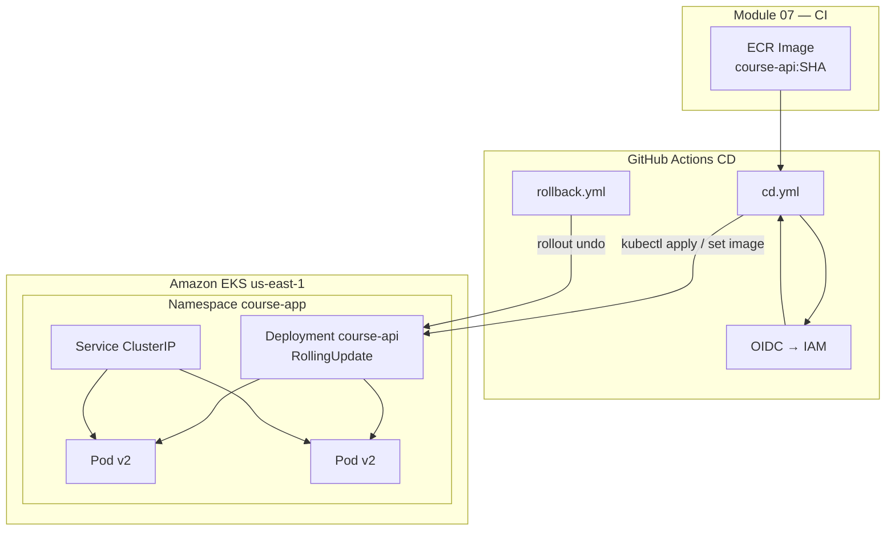

# Module 08 — CD Pipeline: Deploy to EKS, Rolling Updates, Rollback

Implement **continuous deployment** to Amazon EKS: deploy container images from ECR, perform **rolling updates** with controlled surge/unavailability, and **rollback** to a previous revision when deployments fail.

**Region:** `us-east-1`  
**Estimated time:** 3–4 hours

---

## Learning Objectives

By the end of this module you will be able to:

1. Design a CD workflow that deploys to EKS after CI publishes an image.
2. Configure Deployment **rolling update** strategy (`maxSurge`, `maxUnavailable`).
3. Use `kubectl` in GitHub Actions with OIDC-authenticated AWS credentials.
4. Update image tags in manifests dynamically or with `kubectl set image`.
5. Monitor rollout status and detect failed deployments.
6. Execute **rollback** via `kubectl rollout undo` or a dedicated workflow.

---

## Theory

### CI vs CD

| Phase | Responsibility |
| --- | --- |
| **CI** (Module 07) | Test, build image, push to ECR |
| **CD** (this module) | Deploy image to Kubernetes, verify health, rollback if needed |

CD typically runs on `push` to `main` or on release tags, after CI succeeds.

### Rolling Updates

Kubernetes Deployments replace Pods gradually:

```yaml
strategy:
  type: RollingUpdate
  rollingUpdate:
    maxSurge: 1        # Extra Pods allowed above desired count
    maxUnavailable: 0  # Minimum Pods that can be down during update
```

- **`maxSurge: 1`, `maxUnavailable: 0`** — zero-downtime (capacity +1 during roll)
- **`maxSurge: 25%`, `maxUnavailable: 25%`** — faster but brief capacity dip

### Rollback

Kubernetes keeps **ReplicaSet** history (`revisionHistoryLimit`). Roll back with:

```bash
kubectl rollout undo deployment/course-api -n course-app
kubectl rollout undo deployment/course-api -n course-app --to-revision=3
```

### GitHub Actions → EKS

1. Assume IAM role via OIDC (needs `eks:DescribeCluster`, kubectl access)
2. `aws eks update-kubeconfig`
3. `kubectl apply` or `kubectl set image`
4. `kubectl rollout status` — fail workflow if rollout stalls

### Helm vs kubectl

This module uses **kubectl** for clarity. Helm adds templating and release history — suitable for Module 10+ production patterns.

---

## Architecture Diagram



---

## Folder Structure

```text
module-08-cd/
├── README.md
├── EXERCISE.md
└── solution/
    ├── SOLUTION.md
    ├── k8s/
    │   ├── namespace.yaml
    │   ├── deployment.yaml
    │   ├── service.yaml
    │   └── configmap.yaml
    └── .github/
        └── workflows/
            ├── cd.yml
            └── rollback.yml
```

---

## Prerequisites

| Requirement | Notes |
| --- | --- |
| Module 04 | EKS cluster in `us-east-1` |
| Module 07 | ECR image `course-api` with at least one tag |
| kubectl | Configured locally for testing |
| IAM | Role with EKS describe + kubectl (aws-auth or EKS access entry) |

### IAM for CD (extend Module 07 role or create new)

CD role needs:

- `eks:DescribeCluster`
- EKS access entry / `aws-auth` ConfigMap mapping for `system:masters` or scoped RBAC
- `ecr:BatchGetImage` (if pulling cross-account)

Add GitHub secrets:

- `AWS_ROLE_ARN` — CD role (can be same as CI with broader policy)
- `EKS_CLUSTER_NAME` — variable, e.g. `course-eks`

---

## Step-by-Step Instructions

### Step 1 — Review Kubernetes manifests

```bash
cd module-08-cd/solution
cat k8s/deployment.yaml
```

Note `maxSurge`, `maxUnavailable`, probes, and image placeholder.

### Step 2 — Initial deploy (manual baseline)

```bash
export AWS_REGION=us-east-1
export CLUSTER_NAME=course-eks
export ACCOUNT_ID=$(aws sts get-caller-identity --query Account --output text)
export IMAGE="${ACCOUNT_ID}.dkr.ecr.us-east-1.amazonaws.com/course-api:latest"

aws eks update-kubeconfig --region "$AWS_REGION" --name "$CLUSTER_NAME"

kubectl apply -f k8s/namespace.yaml
kubectl apply -f k8s/configmap.yaml

# Substitute image URI
sed "s|IMAGE_PLACEHOLDER|${IMAGE}|g" k8s/deployment.yaml | kubectl apply -f -
kubectl apply -f k8s/service.yaml
```

### Step 3 — Configure GitHub CD workflow

Copy `.github/workflows/cd.yml` to your repo. Set secrets/variables:

- `AWS_ROLE_ARN`
- `AWS_REGION` = `us-east-1`
- `EKS_CLUSTER_NAME` = `course-eks`
- `ECR_REPOSITORY` = `course-api`

### Step 4 — Trigger CD

Push a new commit to `main` after CI builds a new image, or run **CD** workflow manually with `image_tag` input.

### Step 5 — Watch rolling update

```bash
kubectl rollout status deployment/course-api -n course-app --timeout=180s
kubectl get pods -n course-app -w
```

### Step 6 — Simulate failure and rollback

Deploy a bad image tag (exercise) or run **Rollback Deployment** workflow:

GitHub Actions → **Rollback Deployment** → Run workflow → enter revision or use `undo`.

```bash
kubectl rollout history deployment/course-api -n course-app
kubectl rollout undo deployment/course-api -n course-app
```

### Step 7 — Verify application

```bash
kubectl port-forward svc/course-api -n course-app 3000:80
curl http://localhost:3000/health
```

(Service maps port 80 → container 3000.)

---

## Expected Output

```text
$ kubectl rollout status deployment/course-api -n course-app
Waiting for deployment "course-api" rollout to finish: 1 out of 2 new replicas have been updated...
deployment "course-api" successfully rolled out

$ curl -s http://localhost:3000/health
{"status":"healthy","service":"course-api"}
```

CD workflow logs show `kubectl apply`, successful rollout, and deployed image SHA.

---

## Verification Steps

1. Deployment has `strategy.rollingUpdate` with documented `maxSurge` / `maxUnavailable`.
2. CD workflow assumes OIDC role and updates kubeconfig.
3. New image tag from ECR is deployed on each CD run.
4. `kubectl rollout status` succeeds in the workflow.
5. Rollback workflow or documented steps restore previous ReplicaSet.
6. `kubectl rollout history` shows multiple revisions.
7. Readiness probes prevent traffic to unhealthy Pods during rollout.

---

## Common Mistakes

| Mistake | Symptom | Fix |
| --- | --- | --- |
| IAM lacks EKS access | `Unauthorized` from kubectl | Add EKS access entry for role |
| Wrong container name in `set image` | Rollout no-op | Match `containers[].name` in Deployment |
| Image tag doesn't exist | `ImagePullBackOff` | Verify ECR tag matches CI output |
| No rollout wait in CD | Workflow green but app broken | Add `kubectl rollout status` step |
| `maxUnavailable: 50%` on 2 replicas | Brief outage | Use `maxUnavailable: 0` for HA |
| Forgetting namespace | Resources in wrong NS | Pass `-n course-app` everywhere |

---

## Troubleshooting

### Rollout stuck

```bash
kubectl describe deployment course-api -n course-app
kubectl get rs -n course-app
kubectl describe pod -n course-app -l app=course-api
```

Common causes: failed readiness probe, image pull errors.

### CD workflow can't connect to cluster

```bash
aws eks describe-cluster --name course-eks --region us-east-1
```

Verify role ARN in `aws-auth` or EKS access entries.

### Rollback doesn't fix issue

```bash
kubectl rollout history deployment/course-api -n course-app
kubectl rollout undo deployment/course-api -n course-app --to-revision=N
```

Ensure revision N has a working image.

---

## Cleanup Steps

```bash
kubectl delete namespace course-app --ignore-not-found
```

Keep ECR images for Module 12 capstone or delete per Module 07 cleanup.

---

## Summary

You implemented CD to EKS with rolling updates controlled by `maxSurge` and `maxUnavailable`, integrated GitHub Actions with OIDC and kubectl, and practiced rollback via workflow and CLI. Module 09 adds Terraform plan/apply to the pipeline; Module 10 hardens production patterns.

---

## Quiz

1. What do `maxSurge` and `maxUnavailable` control during a rolling update?
2. Why should CD workflows run `kubectl rollout status` after applying changes?
3. What Kubernetes command rolls back to the previous Deployment revision?
4. How does CD obtain credentials to talk to EKS without long-lived kubeconfig secrets in Git?
5. Why map Service port 80 to container port 3000 instead of exposing 3000 directly?

### Answer Key

1. `maxSurge` — extra Pods above desired count; `maxUnavailable` — how many Pods can be unavailable during update
2. To fail the pipeline if new Pods don't become ready — prevents silent broken deploys
3. `kubectl rollout undo deployment/<name>`
4. OIDC → IAM role → `aws eks update-kubeconfig` generates temporary kubeconfig on the runner
5. Convention — external port 80 for HTTP services while app listens on application port internally
