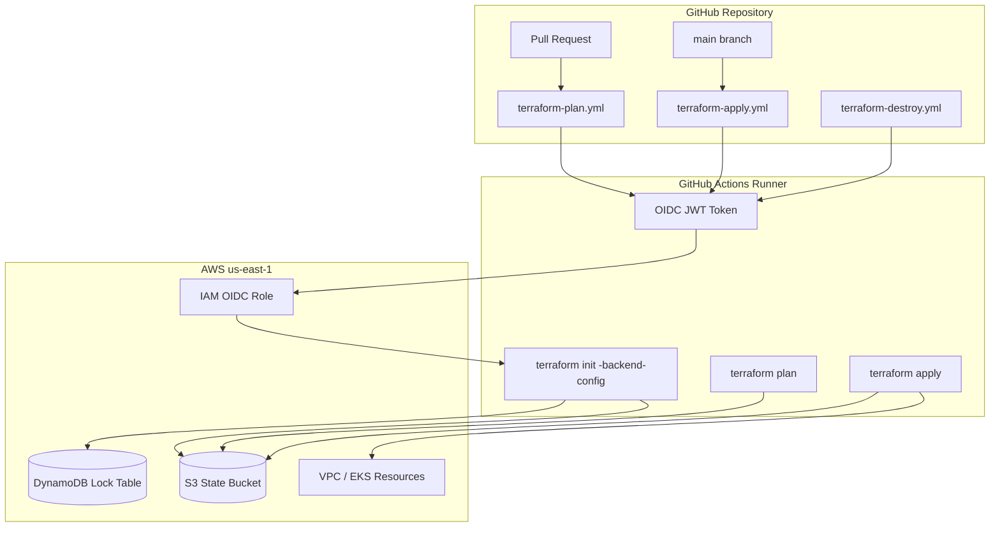

# Module 09: Terraform in GitHub Actions

Automate Terraform **plan**, **apply**, and **destroy** from GitHub Actions using OIDC authentication, an S3 remote backend, DynamoDB state locking, and secure secrets management.

**Region:** `us-east-1`

---

## Learning Objectives

By the end of this module you will be able to:

1. Configure an **S3 + DynamoDB** remote backend for Terraform state with encryption and versioning.
2. Authenticate GitHub Actions to AWS using **OIDC** (no long-lived access keys in secrets).
3. Write separate workflows for **plan**, **apply**, and **destroy** with appropriate triggers and approvals.
4. Pass backend configuration via `backend.hcl` and environment-specific variables.
5. Manage sensitive values with **GitHub Secrets** and **Terraform variables** without committing secrets.
6. Interpret plan output in pull requests and gate applies to protected branches.

---

## Theory

### Why Run Terraform in CI/CD?

Running Terraform locally works for learning, but teams need:

- **Repeatability** — same Terraform version, same credentials, same process every time.
- **Auditability** — who applied what, when, and from which commit.
- **Collaboration** — plan on PRs, apply only after review.
- **Safety** — state locking prevents concurrent applies from corrupting state.

### Remote State Backend

Terraform state must be stored remotely when multiple people or pipelines run Terraform:

| Component | Purpose |
| --- | --- |
| **S3 bucket** | Stores `terraform.tfstate` with versioning and encryption |
| **DynamoDB table** | Provides state locking via conditional writes |
| **KMS (optional)** | Customer-managed encryption for state at rest |

Bootstrap the backend once (manually or via a one-time script), then reference it in `backend.tf` using a partial configuration loaded from `backend.hcl`.

### OIDC vs Static Credentials

**OpenID Connect (OIDC)** lets GitHub Actions assume an IAM role without storing `AWS_ACCESS_KEY_ID` / `AWS_SECRET_ACCESS_KEY`:

1. GitHub issues a short-lived JWT for the workflow run.
2. AWS IAM trusts the GitHub OIDC provider for your repository.
3. The workflow calls `aws-actions/configure-aws-credentials` with `role-to-assume`.

Benefits: no key rotation in GitHub Secrets, least-privilege per workflow, auditable `sts:AssumeRoleWithWebIdentity` events.

### Plan / Apply / Destroy Separation

| Workflow | Trigger | Purpose |
| --- | --- | --- |
| **Plan** | Pull request, push to feature branches | Show diff in PR; no changes |
| **Apply** | Push/merge to `main`, manual `workflow_dispatch` | Create/update infrastructure |
| **Destroy** | Manual only with environment protection | Tear down resources safely |

Never auto-destroy on push. Always require manual confirmation and environment approval for destroy.

### Secrets Management Layers

1. **GitHub Secrets** — `AWS_ROLE_ARN`, optional `TF_VAR_*` overrides; never log them.
2. **Terraform variables** — mark sensitive with `sensitive = true`; pass via `TF_VAR_` env vars in CI.
3. **AWS Secrets Manager / SSM** — runtime secrets for applications (covered more in Module 10).

---

## Architecture Diagram



---

## Folder Structure

```text
module-09-terraform-pipeline/
├── README.md
├── EXERCISE.md
└── solution/
    ├── SOLUTION.md
    ├── terraform/
    │   ├── versions.tf
    │   ├── backend.tf
    │   ├── backend.hcl.example
    │   ├── variables.tf
    │   ├── main.tf
    │   ├── outputs.tf
    │   ├── s3-backend.tf          # Bootstrap resources (run once locally)
    │   └── iam-oidc.tf
    └── .github/
        └── workflows/
            ├── terraform-plan.yml
            ├── terraform-apply.yml
            └── terraform-destroy.yml
```

---

## Prerequisites

- Completed **Modules 02–08** (Terraform basics, networking, EKS, GitHub Actions fundamentals).
- AWS account with permissions for S3, DynamoDB, IAM, and EKS-related resources.
- GitHub repository with **Actions** enabled.
- Tools installed locally: Terraform 1.5+, AWS CLI v2, `jq`.
- Your GitHub org/repo name (e.g. `my-org/github-actions-terraform-eks-course`).

---

## Step-by-Step Instructions

### Step 1: Bootstrap the Remote Backend (One-Time, Local)

```bash
cd solution/terraform
cp backend.hcl.example backend.hcl
# Edit backend.hcl with your unique bucket name

terraform init
terraform apply -target=aws_s3_bucket.terraform_state \
                -target=aws_dynamodb_table.terraform_lock \
                -target=aws_iam_openid_connect_provider.github \
                -target=aws_iam_role.github_actions_terraform
```

Note the outputs: `state_bucket_name`, `dynamodb_table_name`, `github_actions_role_arn`.

### Step 2: Configure GitHub Secrets

In **Settings → Secrets and variables → Actions**, add:

| Secret | Value |
| --- | --- |
| `AWS_ROLE_ARN` | Output `github_actions_role_arn` |
| `TF_STATE_BUCKET` | S3 bucket name |
| `TF_LOCK_TABLE` | DynamoDB table name |

### Step 3: Update OIDC Trust Policy

Edit `iam-oidc.tf` so `sub` matches your repository:

```hcl
"token.actions.githubusercontent.com:sub" = "repo:YOUR_ORG/YOUR_REPO:ref:refs/heads/main"
```

Re-apply the IAM resources after changing the trust policy.

### Step 4: Copy Workflows to Your Repository Root

Place `.github/workflows/*.yml` at the repository root (or monorepo path with `working-directory`).

### Step 5: Open a Pull Request to Trigger Plan

```bash
git checkout -b feature/tf-pipeline
git add .
git commit -m "Add Terraform CI/CD workflows"
git push -u origin feature/tf-pipeline
```

Open a PR — the **Terraform Plan** workflow should comment or upload the plan artifact.

### Step 6: Merge to Apply

After review, merge to `main`. The **Terraform Apply** workflow runs automatically.

### Step 7: (Optional) Manual Destroy

Use **Actions → Terraform Destroy → Run workflow** only in a sandbox. Confirm environment protection if configured.

---

## Expected Output

### Successful Plan (PR)

```text
Plan: 12 to add, 0 to change, 0 to destroy.
```

Workflow summary shows green check; plan artifact or PR comment contains resource list.

### Successful Apply (main)

```text
Apply complete! Resources: 12 added, 0 changed, 0 destroyed.

Outputs:
eks_cluster_name = "module09-eks"
state_bucket_name = "your-unique-tf-state-bucket"
```

### AWS Console

- S3 bucket contains `env:/` or workspace-prefixed state keys.
- DynamoDB table shows lock items during apply (briefly).
- CloudTrail logs `AssumeRoleWithWebIdentity` from GitHub OIDC.

---

## Verification Steps

1. **Backend** — `aws s3 ls s3://YOUR_BUCKET/` shows state file after apply.
2. **Locking** — Run two applies concurrently; second should wait or fail with lock error.
3. **OIDC** — Workflow logs show `Successfully assumed role` without access keys.
4. **Plan on PR** — Opening PR triggers plan only; no resources change until merge.
5. **Destroy gate** — Destroy workflow does not run on push; only `workflow_dispatch`.

```bash
# Local verification (after apply)
cd solution/terraform
terraform init -backend-config=backend.hcl
terraform state list
```

---

## Common Mistakes

| Mistake | Symptom | Fix |
| --- | --- | --- |
| Wrong OIDC `sub` claim | `Not authorized to perform sts:AssumeRoleWithWebIdentity` | Match repo and branch in trust policy |
| Bucket name not globally unique | S3 create fails | Add account ID or random suffix |
| Missing `id-token: write` permission | OIDC token not issued | Add permissions to workflow |
| Backend bucket doesn't exist before remote init | `NoSuchBucket` on init | Bootstrap S3/DynamoDB first |
| Applying from PR branch unintentionally | Infra changes without review | Restrict apply to `main` only |
| Committing `backend.hcl` with secrets | Exposed config | Use `.gitignore`; commit only `.example` |

---

## Troubleshooting

### `Error acquiring the state lock`

Another run holds the lock. Wait or force-unlock only if sure no apply is running:

```bash
terraform force-unlock LOCK_ID
```

### `AccessDenied` on S3 or DynamoDB

Verify the IAM role policy includes `s3:GetObject`, `s3:PutObject`, `dynamodb:GetItem`, `dynamodb:PutItem`, `dynamodb:DeleteItem` on the correct ARNs.

### Plan differs between local and CI

Ensure same Terraform version (`terraform_version` in workflow), same `TF_VAR_*` values, and same backend workspace.

### OIDC thumbprint errors

Use the official `aws-actions/configure-aws-credentials` action; thumbprint for `token.actions.githubusercontent.com` is managed by AWS documentation.

### Workflow not triggering

Check `on:` triggers, branch filters, and that workflow files are on the default branch for `workflow_dispatch`.

---

## Cleanup Steps

1. Run **Terraform Destroy** workflow (or locally with same backend):

   ```bash
   terraform destroy
   ```

2. If bootstrap resources should be removed:

   ```bash
   terraform destroy -target=aws_s3_bucket.terraform_state
   # Empty bucket first if versioning retained objects
   aws s3 rm s3://YOUR_BUCKET --recursive
   ```

3. Remove GitHub Secrets if decommissioning the pipeline.

4. Delete DynamoDB table and S3 bucket after emptying.

**Cost note:** S3 and DynamoDB for state are inexpensive; EKS resources from apply are not — destroy those first.

---

## Summary

You integrated Terraform into GitHub Actions with:

- **Remote state** on S3 with **DynamoDB locking**
- **OIDC** for secure, keyless AWS authentication
- **Separated workflows** for plan, apply, and destroy
- **Secrets** via GitHub Actions and Terraform sensitive variables

This pattern is the foundation for production pipelines in Modules 10–12.

---

## Quiz

1. Why use DynamoDB with an S3 backend instead of S3 alone?
2. What GitHub workflow permission is required for OIDC token issuance?
3. Why should `terraform destroy` not run automatically on every push to `main`?
4. What is the purpose of `backend.hcl` versus values in `backend.tf`?
5. How does the IAM trust policy prevent other repositories from assuming your Terraform role?

### Answer Key

1. DynamoDB provides **state locking** so concurrent runs cannot corrupt state.
2. `permissions: id-token: write` (and typically `contents: read`).
3. Destroy is irreversible; it must be **manual** with explicit approval to prevent accidents.
4. `backend.tf` declares the backend *type*; `backend.hcl` supplies **environment-specific** bucket/table names without hardcoding secrets in Git.
5. The `sub` condition restricts the role to a specific **repo and ref** (e.g. `repo:org/repo:ref:refs/heads/main`).
