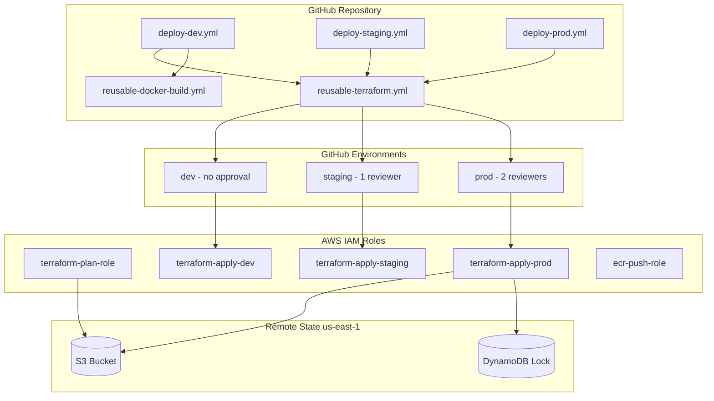

# Module 10: Production Best Practices

Harden your GitHub Actions + Terraform + EKS pipeline with **least-privilege IAM**, **environment separation**, **branch protection**, **GitHub Environments**, and **reusable workflows**.

**Region:** `us-east-1`

---

## Learning Objectives

By the end of this module you will be able to:

1. Split IAM roles and policies for **plan (read)** vs **apply (write)** operations.
2. Organize Terraform for **dev**, **staging**, and **prod** with separate state keys and variables.
3. Create **reusable workflows** callable from environment-specific entry workflows.
4. Configure **GitHub Environments** with protection rules and environment-scoped secrets.
5. Document **branch protection** requirements for production deployments.
6. Apply defense-in-depth for secrets: GitHub Secrets, environments, and AWS IAM boundaries.

---

## Theory

### Least Privilege IAM

Production pipelines should never use one super-admin role for everything:

| Role | Used By | Typical Permissions |
| --- | --- | --- |
| `terraform-plan` | PR workflows | State read, `ec2:Describe*`, `eks:Describe*`, `iam:Get*` |
| `terraform-apply` | main / prod environment | State read/write, resource create/update on scoped ARNs |
| `docker-push` | CI build | `ecr:GetAuthorizationToken`, `ecr:PutImage` on specific repos |
| `k8s-deploy` | CD workflow | `eks:DescribeCluster`, `sts:AssumeRole` into cluster access role |

Use **IAM policy conditions** (`aws:RequestedRegion`, `aws:ResourceTag/Environment`) to limit blast radius.

### Remote State per Environment

Store state in one bucket with **different keys**:

```text
s3://my-tf-state/
├── dev/terraform.tfstate
├── staging/terraform.tfstate
└── prod/terraform.tfstate
```

Alternatively use Terraform **workspaces** — separate keys are often clearer for GitOps teams.

### State Locking

The same DynamoDB table can serve all environments; lock IDs are unique per state file. Never disable locking in production.

### GitHub Environments

Environments add:

- **Required reviewers** before deployment jobs run.
- **Wait timer** (optional cooling-off period).
- **Environment secrets** overriding repository secrets (e.g. different `AWS_ROLE_ARN` per env).
- **Deployment branches** restricting which branches can deploy.

Map: `dev` (auto), `staging` (1 reviewer), `prod` (2 reviewers + branch = main only).

### Reusable Workflows

`workflow_call` lets you define Terraform and Docker build logic once:

```yaml
jobs:
  terraform:
    uses: ./.github/workflows/reusable-terraform.yml
    with:
      environment: prod
      terraform_action: apply
    secrets: inherit
```

Benefits: DRY, consistent pinning, easier audits.

### Branch Protection

Recommended rules for `main`:

- Require pull request reviews (1–2).
- Require status checks: `Terraform Plan`, `Build and Test`.
- Require branches to be up to date.
- Restrict who can push directly.
- Require signed commits (optional).

Document manual GitHub UI steps — branch protection is not fully representable in repo files without GitHub Terraform provider or org policies.

---

## Architecture Diagram



---

## Folder Structure

```text
module-10-production/
├── README.md
├── EXERCISE.md
└── solution/
    ├── SOLUTION.md
    ├── docs/
    │   └── branch-protection.md
    ├── config/
    │   ├── dev.tfvars
    │   ├── staging.tfvars
    │   └── prod.tfvars
    ├── terraform/
    │   ├── versions.tf
    │   ├── backend.tf
    │   ├── variables.tf
    │   ├── main.tf
    │   ├── outputs.tf
    │   └── iam/
    │       ├── plan-role.tf
    │       ├── apply-roles.tf
    │       └── ecr-role.tf
    └── .github/
        └── workflows/
            ├── reusable-terraform.yml
            ├── reusable-docker-build.yml
            ├── deploy-dev.yml
            ├── deploy-staging.yml
            └── deploy-prod.yml
```

---

## Prerequisites

- Completed **Module 09** (remote backend, OIDC, plan/apply/destroy workflows).
- GitHub repository admin access (for branch protection and environments).
- AWS account with IAM permissions to create multiple roles and policies.

---

## Step-by-Step Instructions

### Step 1: Review IAM Split

Open `solution/terraform/iam/` and note separate plan and per-environment apply roles.

### Step 2: Apply IAM Terraform Locally (Once)

```bash
cd solution/terraform
terraform init
terraform apply -var-file=../config/dev.tfvars
```

Record role ARNs from outputs.

### Step 3: Configure GitHub Environments

In **Settings → Environments**, create:

| Environment | Reviewers | Secrets |
| --- | --- | --- |
| `dev` | None | `AWS_APPLY_ROLE_ARN` (dev apply role) |
| `staging` | 1 team member | `AWS_APPLY_ROLE_ARN` (staging role) |
| `prod` | 2 team members | `AWS_APPLY_ROLE_ARN` (prod role) |

Repository-level secrets:

- `AWS_PLAN_ROLE_ARN`
- `TF_STATE_BUCKET`
- `TF_LOCK_TABLE`
- `ECR_REPOSITORY`

### Step 4: Set Up Branch Protection

Follow `solution/docs/branch-protection.md` to protect `main`.

### Step 5: Deploy to Dev

Push to `develop` or run **Deploy Dev** workflow manually. Verify auto-apply without approval.

### Step 6: Deploy to Staging

Open PR to `main`, merge, run **Deploy Staging** — approve when prompted.

### Step 7: Deploy to Production

Run **Deploy Prod** from `main` only; two reviewers must approve.

---

## Expected Output

### Dev Deployment

```text
✓ reusable-terraform / terraform (dev)
  Apply complete! Resources: 3 added, 0 changed, 0 destroyed.
```

### Staging / Prod

Workflow pauses at **Waiting for review** until approvers accept.

### IAM Console

Distinct roles: `gha-terraform-plan`, `gha-terraform-apply-dev`, `gha-terraform-apply-staging`, `gha-terraform-apply-prod`.

---

## Verification Steps

1. PR shows plan using **plan role** only (no create permissions — verify with intentional apply failure test in sandbox).
2. Each environment uses a **different state key** in S3.
3. Prod workflow cannot run from a feature branch (workflow `if` + environment branch rule).
4. Reusable workflow appears in Actions UI as a called workflow.
5. ECR push workflow assumes **ecr-push role** with repository-scoped policy.

```bash
aws iam simulate-principal-policy \
  --policy-source-arn arn:aws:iam::ACCOUNT:role/gha-terraform-plan \
  --action-names ec2:RunInstances \
  --resource-arns "*"
# Expected: implicitDeny or explicitDeny for plan role
```

---

## Common Mistakes

| Mistake | Symptom | Fix |
| --- | --- | --- |
| Same apply role for all envs | Prod compromise affects dev | Per-environment roles and secrets |
| `secrets: inherit` without environment secrets | Wrong role used | Set `AWS_APPLY_ROLE_ARN` per environment |
| Reusable workflow missing `workflow_call` trigger | `workflow not found` | Add `on: workflow_call` with inputs |
| Branch protection not requiring plan check | Broken code merges | Add required status check name exactly |
| Overly broad plan role with write access | Plan step can modify infra | Audit with IAM simulator |

---

## Troubleshooting

### Environment approval never requested

Ensure the job specifies `environment: prod` and that environment exists with protection rules enabled.

### Reusable workflow permission denied on OIDC

Caller workflow must pass `permissions: id-token: write` and child must inherit or redeclare.

### Wrong tfvars applied

Check `with: tfvars_file` input path and `working-directory` in reusable workflow.

### State collision between environments

Verify `key` or `workspace` includes environment name in backend config step.

---

## Cleanup Steps

1. Destroy per-environment resources:

   ```bash
   terraform destroy -var-file=../config/dev.tfvars
   ```

2. Remove GitHub Environments and environment secrets.

3. Delete IAM roles created by this module if not shared with Module 12.

4. Revert branch protection if this was a training repo.

---

## Summary

Production readiness means **separating concerns**: plan vs apply IAM, environment-specific state and secrets, human gates for staging/prod, reusable workflows for consistency, and branch protection for code quality. Module 11 adds observability; Module 12 combines everything in the capstone.

---

## Quiz

1. Why should plan and apply use different IAM roles?
2. What GitHub feature adds required reviewers before a job runs?
3. How do reusable workflows reduce maintenance burden?
4. Why use separate state keys per environment in one S3 bucket?
5. Name three branch protection rules recommended for `main`.

### Answer Key

1. Plan only needs **read** access; limiting apply role permissions reduces blast radius if CI is compromised.
2. **GitHub Environments** with protection rules.
3. Logic is defined **once** (`workflow_call`); callers pass inputs — fixes and version pins propagate everywhere.
4. Isolates infrastructure state so dev changes cannot corrupt prod state; single bucket simplifies backup policy.
5. Required PR reviews, required status checks (e.g. Terraform Plan), restrict direct pushes / require up-to-date branches.
