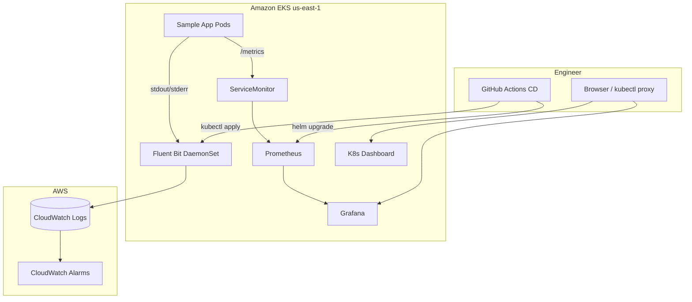

# Module 11: Monitoring and Observability

Deploy **Prometheus**, **Grafana**, **Kubernetes Dashboard**, and centralized **logging** on Amazon EKS to observe application health, cluster metrics, and troubleshoot failures.

**Region:** `us-east-1`

---

## Learning Objectives

By the end of this module you will be able to:

1. Install the **kube-prometheus-stack** Helm chart (Prometheus Operator + Grafana + Alertmanager).
2. Configure a **ServiceMonitor** to scrape metrics from your sample application.
3. Access **Grafana** dashboards and import or customize JSON dashboards.
4. Deploy **Kubernetes Dashboard** with least-privilege RBAC.
5. Ship container logs to **Amazon CloudWatch** using **Fluent Bit** (or aws-for-fluent-bit).
6. Integrate monitoring deployment into a GitHub Actions CD workflow.

---

## Theory

### The Three Pillars on Kubernetes

| Pillar | Tool in This Module | What You Learn |
| --- | --- | --- |
| **Metrics** | Prometheus + Grafana | CPU, memory, request rates, custom app metrics |
| **Logs** | Fluent Bit → CloudWatch Logs | Pod stdout/stderr, centralized search |
| **Dashboards** | Grafana + K8s Dashboard | Visualization and quick cluster inspection |

### Prometheus Operator Pattern

The **kube-prometheus-stack** chart installs:

- **Prometheus Operator** — manages Prometheus CRDs (`Prometheus`, `ServiceMonitor`, `PodMonitor`).
- **Prometheus** — time-series database scraping targets every 30s (configurable).
- **Grafana** — pre-built Kubernetes dashboards; datasource wired to Prometheus.
- **Alertmanager** — routes alerts (email, Slack, PagerDuty) — optional for course.

You declare scrape targets with **`ServiceMonitor`** resources instead of editing `prometheus.yml` manually.

### ServiceMonitor

A `ServiceMonitor` tells Prometheus which Services to scrape:

```yaml
selector:
  matchLabels:
    app: sample-app
endpoints:
  - port: metrics
    interval: 30s
```

Your app must expose a `/metrics` endpoint (Prometheus format) on the named port.

### Kubernetes Dashboard

Official web UI for workloads, pods, and events. **Never expose publicly without authentication.** Use `kubectl proxy` or an internal ingress with OIDC. RBAC should follow least privilege — read-only ClusterRole for viewers.

### Log Shipping with Fluent Bit

**Fluent Bit** runs as a DaemonSet (one pod per node), tails container logs from `/var/log/containers/`, and forwards to **CloudWatch Logs** log groups:

```text
/aws/eks/gha-terraform-eks/cluster
/aws/eks/gha-terraform-eks/application
```

Benefits: no SSH to nodes, retention policies, Logs Insights queries, integration with alarms.

### CloudWatch vs In-Cluster Logs

| Approach | Pros | Cons |
| --- | --- | --- |
| Fluent Bit → CloudWatch | Durable, AWS-native, cross-cluster | Cost per ingested GB |
| Loki (in-cluster) | Cheap, Grafana integration | Extra operational burden |

This module uses CloudWatch for AWS alignment.

---

## Architecture Diagram



---

## Folder Structure

```text
module-11-monitoring/
├── README.md
├── EXERCISE.md
└── solution/
    ├── SOLUTION.md
    ├── helm/
    │   └── kube-prometheus-stack-values.yaml
    ├── kubernetes/
    │   ├── namespace-monitoring.yaml
    │   ├── servicemonitor-sample-app.yaml
    │   ├── sample-app-metrics.yaml
    │   ├── kubernetes-dashboard.yaml
    │   └── fluent-bit/
    │       ├── fluent-bit-config.yaml
    │       ├── fluent-bit-daemonset.yaml
    │       └── cloudwatch-iam.md
    ├── grafana/
    │   ├── dashboard-kubernetes-cluster.json
    │   └── setup-grafana.md
    └── .github/
        └── workflows/
            └── deploy-monitoring.yml
```

---

## Prerequisites

- Completed **Modules 04–05** (EKS cluster and sample app deployed).
- `kubectl` configured for your cluster (`aws eks update-kubeconfig`).
- `helm` 3.12+ installed.
- IAM permissions for CloudWatch Logs (`logs:CreateLogGroup`, `logs:PutLogEvents`).
- **IRSA** (IAM Roles for Service Accounts) enabled on the EKS cluster.

---

## Step-by-Step Instructions

### Step 1: Create Monitoring Namespace

```bash
kubectl apply -f solution/kubernetes/namespace-monitoring.yaml
```

### Step 2: Install kube-prometheus-stack

```bash
helm repo add prometheus-community https://prometheus-community.github.io/helm-charts
helm repo update

helm upgrade --install kube-prometheus-stack prometheus-community/kube-prometheus-stack \
  --namespace monitoring \
  -f solution/helm/kube-prometheus-stack-values.yaml
```

### Step 3: Deploy Sample App with Metrics

```bash
kubectl apply -f solution/kubernetes/sample-app-metrics.yaml
kubectl apply -f solution/kubernetes/servicemonitor-sample-app.yaml
```

### Step 4: Verify Prometheus Targets

```bash
kubectl port-forward -n monitoring svc/kube-prometheus-stack-prometheus 9090:9090
# Open http://localhost:9090/targets — sample-app should be UP
```

### Step 5: Access Grafana

```bash
kubectl port-forward -n monitoring svc/kube-prometheus-stack-grafana 3000:80
# Default user: admin — get password:
kubectl get secret -n monitoring kube-prometheus-stack-grafana \
  -o jsonpath="{.data.admin-password}" | base64 -d
```

Follow `solution/grafana/setup-grafana.md` to import the dashboard JSON.

### Step 6: Deploy Fluent Bit

Configure IRSA per `solution/kubernetes/fluent-bit/cloudwatch-iam.md`, then:

```bash
kubectl apply -f solution/kubernetes/fluent-bit/
```

### Step 7: Deploy Kubernetes Dashboard

```bash
kubectl apply -f solution/kubernetes/kubernetes-dashboard.yaml
kubectl proxy
# http://localhost:8001/api/v1/namespaces/kubernetes-dashboard/services/https:kubernetes-dashboard:/proxy/
```

### Step 8: (Optional) GitHub Actions

Push to trigger `deploy-monitoring.yml` for repeatable installs.

---

## Expected Output

### Helm Install

```text
STATUS: deployed
REVISION: 1
NOTES: kube-prometheus-stack has been installed
```

### Prometheus Target

`sample-app` endpoint state: **UP**, labels include `namespace="default"`.

### CloudWatch

Log groups appear:

```text
/aws/eks/gha-terraform-eks/application
```

### Grafana

Kubernetes / Compute Resources / Cluster dashboard shows node and pod CPU graphs.

---

## Verification Steps

1. `kubectl get pods -n monitoring` — all pods Running.
2. Prometheus targets page shows `sample-app` without scrape errors.
3. Grafana datasource `Prometheus` is green (test successful).
4. Generate log traffic: `kubectl logs -f deployment/sample-app` and confirm lines in CloudWatch Logs Insights.
5. Kubernetes Dashboard shows deployments without RBAC errors.

```bash
# Logs Insights query
fields @timestamp, @message
| filter kubernetes.pod_name like /sample-app/
| sort @timestamp desc
| limit 20
```

---

## Common Mistakes

| Mistake | Symptom | Fix |
| --- | --- | --- |
| ServiceMonitor wrong namespace | Target missing | Set `namespaceSelector` or deploy SM in same ns |
| App metrics on wrong port name | Connection refused | Match `port:` in SM to Service `port.name` |
| Fluent Bit no IRSA | AccessDenied on PutLogEvents | Annotate SA with `eks.amazonaws.com/role-arn` |
| Grafana admin password unknown | Login fails | Read secret from `kube-prometheus-stack-grafana` |
| Dashboard exposed via public LB | Security risk | Use port-forward or private ingress + SSO |

---

## Troubleshooting

### Prometheus pod CrashLoopBackOff

Check resources — increase limits in `values.yaml` for small clusters.

### ServiceMonitor not picked up

Verify `release: kube-prometheus-stack` label on ServiceMonitor matches Prometheus `serviceMonitorSelector`.

### No logs in CloudWatch

Check Fluent Bit pod logs: `kubectl logs -n amazon-cloudwatch -l app=fluent-bit`.

### IRSA not working

```bash
kubectl describe sa fluent-bit -n amazon-cloudwatch
# Verify role ARN annotation
aws sts get-caller-identity # on pod via debug container
```

---

## Cleanup Steps

```bash
helm uninstall kube-prometheus-stack -n monitoring
kubectl delete namespace monitoring
kubectl delete -f solution/kubernetes/fluent-bit/
kubectl delete -f solution/kubernetes/kubernetes-dashboard.yaml
aws logs delete-log-group --log-group-name /aws/eks/gha-terraform-eks/application
```

---

## Summary

You added production-style observability: Prometheus scraping via ServiceMonitors, Grafana dashboards, Kubernetes Dashboard for ops, and Fluent Bit shipping logs to CloudWatch. Module 12 integrates monitoring into the full capstone pipeline.

---

## Quiz

1. What CRD replaces manual `prometheus.yml` scrape config edits?
2. Why is Fluent Bit deployed as a DaemonSet?
3. What RBAC risk exists when exposing Kubernetes Dashboard publicly?
4. How does a ServiceMonitor select which pods to scrape?
5. Name two log groups you would create for an EKS application.

### Answer Key

1. **ServiceMonitor** (and PodMonitor) managed by Prometheus Operator.
2. One Fluent Bit pod per **node** tails all container logs on that node.
3. Unauthorized users may access cluster secrets and workloads — requires **strong auth** and least-privilege RBAC.
4. Via `selector.matchLabels` matching Service labels, plus `endpoints.port` for the metrics port.
5. Example: `/aws/eks/CLUSTER/application` and `/aws/eks/CLUSTER/dataplane` (or cluster audit logs).
