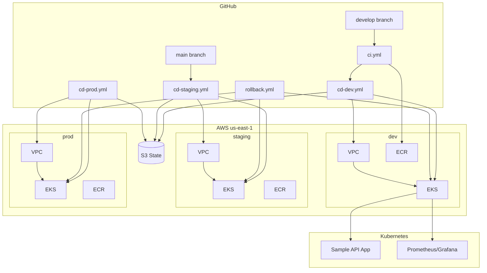

# Module 12: Final Capstone — Production-Ready Pipeline

Build the **complete end-to-end system**: multi-environment Terraform (VPC, EKS, ECR), GitHub Actions CI/CD with approval gates, Kubernetes deployments with Kustomize overlays, rollback, and integrated monitoring.

**Region:** `us-east-1`

---

## Learning Objectives

By the end of this capstone you will be able to:

1. Structure a **multi-environment** repository (`dev`, `staging`, `prod`) with isolated Terraform state.
2. Compose **Terraform modules** for networking, EKS, and ECR.
3. Run a full **CI pipeline**: test, build Docker image, push to environment-specific ECR.
4. Run **CD pipelines** with GitHub Environment approvals for staging and production.
5. Deploy applications using **Kustomize overlays** per environment.
6. Execute **rollbacks** to a previous image tag safely.
7. Integrate **monitoring** from Module 11 into the deployment flow.

---

## Theory

### Capstone Architecture

The capstone unifies Modules 01–11:

```text
Code Push → CI (test, build, ECR) → CD (Terraform + kubectl) → EKS → Monitoring
```

Each environment has:

- Dedicated **Terraform state key** (`dev/`, `staging/`, `prod/`)
- Dedicated **EKS cluster** (or namespace isolation — this solution uses separate clusters per env for clarity)
- Dedicated **ECR repository**
- **Kustomize overlay** adjusting replicas, resources, and image tags

### Approval Gates

| Environment | Trigger | Approval |
| --- | --- | --- |
| dev | Push to `develop` | None |
| staging | Push to `main` | 1 reviewer |
| prod | Manual `workflow_dispatch` | 2 reviewers + confirmation input |

### Rollback Strategy

Kubernetes rollback options:

1. **`kubectl rollout undo`** — Reverts to previous ReplicaSet (fast, in-cluster).
2. **Redeploy previous image tag** — CI/CD checks out tag or passes `image_tag` input (auditable, preferred in GitOps).

This capstone implements **workflow_dispatch rollback** with explicit image SHA.

### Terraform Module Composition

```text
main.tf
├── module.networking  → VPC, subnets, NAT
├── module.eks         → Cluster, node groups, IRSA
└── module.ecr         → Container registry
```

Root module passes environment-specific variables from `environments/<env>/terraform.tfvars`.

---

## Architecture Diagram



---

## Folder Structure

```text
module-12-capstone/
├── README.md
├── EXERCISE.md
└── solution/
    ├── SOLUTION.md
    ├── app/
    │   ├── Dockerfile
    │   ├── package.json
    │   └── src/server.js
    ├── environments/
    │   ├── dev/terraform.tfvars
    │   ├── staging/terraform.tfvars
    │   └── prod/terraform.tfvars
    ├── terraform/
    │   ├── main.tf
    │   ├── variables.tf
    │   ├── outputs.tf
    │   ├── versions.tf
    │   ├── backend.tf
    │   └── modules/
    │       ├── networking/
    │       ├── eks/
    │       └── ecr/
    ├── kubernetes/
    │   ├── base/
    │   │   ├── kustomization.yaml
    │   │   ├── deployment.yaml
    │   │   ├── service.yaml
    │   │   └── servicemonitor.yaml
    │   └── overlays/
    │       ├── dev/
    │       ├── staging/
    │       └── prod/
    ├── monitoring/
    │   └── helm-values.yaml
    └── .github/workflows/
        ├── ci.yml
        ├── cd-dev.yml
        ├── cd-staging.yml
        ├── cd-prod.yml
        ├── rollback.yml
        └── deploy-monitoring.yml
```

---

## Prerequisites

- Completed **Modules 01–11**.
- AWS account with sufficient service quotas (3 EKS clusters is expensive — use `dev` only for cost-saving practice).
- GitHub Environments configured: `dev`, `staging`, `prod`.
- Remote state bucket and DynamoDB lock from Module 09.
- All IAM roles from Module 10.

---

## Step-by-Step Instructions

### Step 1: Configure Environment Variables

Edit `environments/dev/terraform.tfvars` with your `github_org`, `github_repo`, and `state_bucket_name`.

### Step 2: Bootstrap Terraform (Dev First)

```bash
cd solution/terraform
terraform init -backend-config="key=dev/terraform.tfstate" \
  -backend-config="bucket=YOUR_BUCKET" \
  -backend-config="region=us-east-1" \
  -backend-config="dynamodb_table=YOUR_LOCK"
terraform apply -var-file=../environments/dev/terraform.tfvars
```

### Step 3: Configure GitHub Secrets

| Secret | Description |
| --- | --- |
| `TF_STATE_BUCKET` | State bucket |
| `TF_LOCK_TABLE` | DynamoDB lock |
| `AWS_PLAN_ROLE_ARN` | Plan role |
| `AWS_APPLY_ROLE_ARN` | Per-environment apply role |
| `AWS_EKS_DEPLOY_ROLE_ARN` | kubectl/helm deploy role |
| `ECR_PUSH_ROLE_ARN` | ECR push role |

### Step 4: Push to `develop` — CI + CD Dev

```bash
git checkout develop
git push origin develop
```

Watch **CI** then **CD Dev** workflows complete.

### Step 5: Merge to `main` — Staging

Approve staging deployment when prompted.

### Step 6: Production Deploy

Run **CD Prod** from `main`, type `deploy-prod`, obtain two approvals.

### Step 7: Verify Application

```bash
aws eks update-kubeconfig --name gha-terraform-eks-dev --region us-east-1
kubectl get pods -n capstone-app
kubectl port-forward -n capstone-app svc/capstone-api 8080:80
curl http://localhost:8080/health
```

### Step 8: Rollback Test

Run **Rollback** workflow with previous image SHA and `environment=dev`.

### Step 9: Deploy Monitoring

Run **Deploy Monitoring** or include in CD pipeline.

---

## Expected Output

### CI Workflow

```text
✓ Run tests
✓ Build Docker image
✓ Push to 123456789.dkr.ecr.us-east-1.amazonaws.com/gha-terraform-eks-dev-capstone-api:abc1234
```

### CD Dev

```text
✓ Terraform apply (dev)
✓ Update kubeconfig
✓ kustomize build overlays/dev | kubectl apply
✓ rollout status deployment/capstone-api
```

### Application

```json
{"status":"healthy","environment":"dev","version":"abc1234"}
```

---

## Verification Steps

1. Three separate state files in S3 (if all envs deployed): `dev/`, `staging/`, `prod/`.
2. `kubectl get nodes` works for each cluster.
3. ECR contains images tagged with Git SHA.
4. Staging/prod workflows pause for approval.
5. Rollback workflow deploys previous tag and pods recycle.
6. Prometheus scrapes `capstone-api` ServiceMonitor.
7. CloudWatch receives application logs.

---

## Common Mistakes

| Mistake | Symptom | Fix |
| --- | --- | --- |
| Kustomize image tag not updated in CI | Old image deployed | Set `images:` in overlay or use `kustomize edit set image` |
| Terraform and kubectl env mismatch | Deploy to wrong cluster | Pass `environment` consistently; use matrix |
| Skipping staging | Prod bugs | Enforce promotion path in docs and branch rules |
| Rollback without health check | Silent failure | Add `kubectl rollout status` after rollback |
| Full 3-cluster cost overrun | High AWS bill | Destroy staging/prod when not practicing |

---

## Troubleshooting

### EKS auth failure in workflow

Verify deploy role has `eks:DescribeCluster` and trust policy includes `environment:dev` subject.

### ImagePullBackOff

Check ECR repository policy and node IAM role for `ecr:GetAuthorizationToken`.

### Terraform state lock during CD

Serialize applies per environment; don't run dev and staging apply concurrently on same state.

### Kustomize overlay not found

Verify `working-directory` and path `kubernetes/overlays/${{ env }}`.

---

## Cleanup Steps

1. Run destroy per environment (Module 09 destroy workflow adapted for capstone).
2. Delete ECR images and repositories.
3. Remove GitHub Environments.
4. Delete CloudWatch log groups.
5. Empty and optionally delete S3 state bucket.

**Order:** K8s workloads → EKS → VPC → ECR → IAM (if dedicated).

---

## Summary

Congratulations — you built a **production-style** pipeline: modular Terraform, environment isolation, OIDC throughout, container CI, Kustomize CD, approval gates, rollback, and observability. This capstone is a template you can adapt for real teams.

---

## Quiz

1. Why use separate Terraform state keys per environment in one bucket?
2. What is the difference between `kubectl rollout undo` and redeploying a previous image tag in CI/CD?
3. Name three inputs the production CD workflow should require before deploy.
4. How does Kustomize avoid duplicating entire manifests per environment?
5. Which Module 11 component proves the capstone app is healthy over time?

### Answer Key

1. **Isolates blast radius** — dev mistakes cannot overwrite prod state; shared bucket simplifies backup.
2. `rollout undo` is fast/in-cluster; **redeploying a tag** is auditable in GitHub Actions and matches GitOps promotion.
3. Examples: **manual dispatch**, typed confirmation (`deploy-prod`), **two reviewer approvals**, branch = `main`.
4. **Base** manifests + **overlays** patch replicas, images, and config per env.
5. **ServiceMonitor** + Prometheus (and Grafana dashboards / health metrics).
