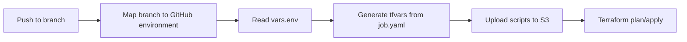
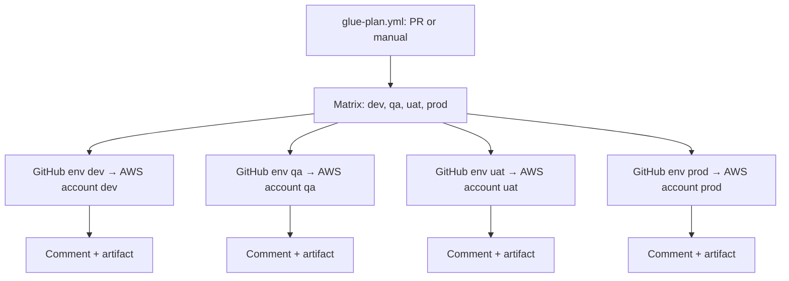

# Module 13 project — config-driven AWS Glue jobs

Hands-on lab for [Module 13](../README.md): YAML-defined Glue jobs, one Terraform stack with `for_each`, and GitHub Actions CI/CD using OIDC.

Treat this `project/` directory as the Git repository root when you copy it into a dedicated Glue repo. Workflow paths and Python helpers assume `gluejobs/` and `.github/workflows/` sit at that root.

**Cost warning:** Glue workers are billable. Use the sample jobs in a sandbox account, prefer 1–2 `G.1X` workers, and destroy jobs when you are done.

Config-driven AWS Glue jobs with reusable GitHub Actions CI/CD and Terraform.

## Architecture

```
gluejobs/                    # Entire Glue domain lives here
  customer-etl/
    job.yaml                 # One file per job, all stages inside
    scripts/main.py          # Job ETL runtime (uploaded to S3)
  orders-etl/
  inventory-sync/
  terraform/                 # One stack for ALL glue jobs
    main.tf
    variables.tf
    generated/
  scripts/                   # Shared Glue CI helpers
    generate-tfvars.py
    detect-changed-jobs.py
    requirements.txt

.github/workflows/           # Glue-prefixed (other domains can add their own)
  glue-deploy.yml            # push → apply (one env)
  glue-plan.yml              # PR or manual → plan all envs
  reusable-glue-terraform.yml
```

Monorepo convention: anything **outside** `gluejobs/` that belongs to Glue must include `glue` in the filename so it does not collide with future pipelines.

## Branch → Environment Mapping

| Branch | GitHub Environment | `vars.env` |
|--------|-------------------|------------|
| `main` | `dev` | `dev` |
| `qa` | `qa` | `qa` |
| `uat` | `uat` | `uat` |
| `prod` | `prod` | `prod` |

Promotion flow: merge `main` → `qa` → `uat` → `prod` when ready.

`glue-deploy.yml` maps the branch to the GitHub environment. Inside that environment, `vars.env` drives Terraform and script generation.

## Terraform: Module or Not?

**No separate module needed here.** This repo only manages `aws_glue_job` resources. A thin wrapper module adds indirection without reuse benefit.

| Approach | Recommendation |
|----------|----------------|
| **Inline `for_each` on `aws_glue_job`** (this repo) | Best fit — one stack under `gluejobs/terraform/`, config from YAML |
| **Separate `modules/glue-job/`** | Only if you reuse the module across multiple Terraform roots/repos |
| **Terraform per job folder** | Avoid — duplicates state and CI for every job |

What lives in `gluejobs/terraform/`:
- One `aws_glue_job` resource with `for_each = var.glue_jobs`
- Deploys all active jobs for the current stage in one apply

What stays outside Terraform:
- Per-job scripts and `job.yaml` in `gluejobs/<job-name>/`
- Per-environment IAM roles and S3 buckets (GitHub environment variables)
- Script upload in CI (not Terraform)

**Do not** put Terraform inside each job folder (`gluejobs/customer-etl/terraform/`). One shared stack deploys all jobs; each job folder only holds its script and config.

## Job Configuration (`job.yaml`)

Each job folder has a `job.yaml` with three supported patterns:

### 1. Mixed arguments (shared + per-stage)

```yaml
default_arguments:
  --enable-metrics: ""
  --database: analytics

stages:
  dev:
    arguments:
      --env: dev
      --source-bucket: acme-data-dev
  prod:
    glue_version: "5.0"
    number_of_workers: 10
    arguments:
      --env: prod
```

### 2. Same arguments for all stages

```yaml
default_arguments:
  --catalog-database: orders
  --write-mode: append

stages:
  dev:
    number_of_workers: 2
  prod:
    number_of_workers: 20
```

### 3. Stage-only arguments

```yaml
stages:
  dev:
    glue_version: "3.0"
    arguments:
      --env: dev
  prod:
    glue_version: "5.0"
    arguments:
      --env: prod
```

Merge rules:
1. Job-level fields are the base.
2. `default_arguments` apply to every stage.
3. `stages.<env>` overrides any job field.
4. Stage `arguments` are merged on top of `default_arguments`.

### 4. Skip a job for specific stages

By default every job deploys to all stages (`dev`, `qa`, `uat`, `prod`). To skip one or more stages, use either option:

**Option A — `skip_stages` list** (good for skipping multiple stages):

```yaml
name: orders-etl
skip_stages:
  - qa
```

**Option B — `skip: true` under a stage** (good for skipping one stage):

```yaml
stages:
  qa:
    skip: true
  prod:
    arguments:
      --env: prod
```

When a job is skipped for a stage:
- It is **omitted** from generated Terraform vars for that stage
- Its scripts are **not uploaded** to S3 for that stage
- CI logs which jobs were skipped

If the job was previously deployed in that stage, the next Terraform apply will **destroy** it there. That is expected when you add a skip.

## Adding a New Glue Job

```bash
mkdir -p gluejobs/my-new-job/scripts
touch gluejobs/my-new-job/scripts/main.py
```

Create `gluejobs/my-new-job/job.yaml`:

```yaml
name: my-new-job
description: My new ETL job
glue_version: "4.0"
worker_type: G.1X
number_of_workers: 2
script: scripts/main.py

stages:
  dev:
    arguments:
      --env: dev
  qa:
    arguments:
      --env: qa
  uat:
    arguments:
      --env: uat
  prod:
    arguments:
      --env: prod
```

Push to `main` to deploy to dev. No Terraform edits required.

## Local Development

```bash
pip install -r gluejobs/scripts/requirements.txt

# Generate tfvars for one stage (same as CI)
python gluejobs/scripts/generate-tfvars.py --stage dev

# Generate for all stages (writes to gluejobs/terraform/generated/<stage>/)
python gluejobs/scripts/generate-tfvars.py

# Preview resolved config
cat gluejobs/terraform/generated/glue-jobs.auto.tfvars.json
```

## GitHub Setup

### Environments

Create GitHub environments: `dev`, `qa`, `uat`, `prod` (optional protection rules on `prod`).

### Secrets (same name on each GitHub environment)

| Secret | Description |
|--------|-------------|
| `AWS_ROLE_ARN` | OIDC IAM role for that environment |

### Variables (set on each GitHub environment)

| Variable | Example (dev) |
|----------|---------------|
| `env` | `dev` |
| `GLUE_ROLE_ARN` | `arn:aws:iam::123456789012:role/glue-execution-role-dev` |
| `SCRIPTS_S3_BUCKET` | `acme-glue-scripts-dev` |
| `SCRIPTS_S3_PREFIX` | `glue-jobs` |
| `AWS_REGION` | `us-east-1` (optional) |

The `env` variable is the source of truth used by CI for `--stage`, Terraform `-var=environment=...`, and the state file key (`glue-jobs/<env>/terraform.tfstate`).

### Terraform backend

Configure the shared S3 backend in `gluejobs/terraform/versions.tf`. CI sets the state key per environment at init:

```bash
cd gluejobs/terraform
terraform init -backend-config="key=glue-jobs/dev/terraform.tfstate"
```

Copy `gluejobs/terraform/terraform.tfvars.example` to `terraform.tfvars` for local runs.

## CI/CD Workflows

All Glue Terraform logic lives in **`reusable-glue-terraform.yml`**. Callers pass `terraform_action`:

| Workflow | Trigger | `terraform_action` |
|----------|---------|--------------------|
| `glue-deploy.yml` | Push to main/qa/uat/prod | `apply` |
| `glue-plan.yml` | Pull request **or** manual Run workflow | `plan` (matrix: all envs) |

| `terraform_action` | Steps run |
|--------------------|-----------|
| `plan` | generate tfvars → init → plan → artifact (+ PR comment if from a PR) |
| `apply` | generate tfvars → upload scripts → init → plan → apply |

### Path filters (monorepo-safe)

**`glue-plan.yml`** (PR / manual) — config and infra changes only:

```yaml
paths:
  - "gluejobs/terraform/**"
  - "gluejobs/scripts/**"
  - "gluejobs/*/job.yaml"
  - "gluejobs/*/job.yml"
  - ".github/workflows/*glue-*.yml"
```

**`glue-deploy.yml`** (push) — any change under the Glue domain:

```yaml
paths:
  - "gluejobs/**"
```

`gluejobs/scripts/requirements.txt` is for local installs only. CI installs deps in the workflow step (`pip install pyyaml`) and does not use that file.

### Selective plan/apply (only changed jobs)

With 5–10 jobs, CI detects which job folders changed and uses Terraform `-target` so only those jobs are planned/applied.

| Change | Behavior |
|--------|----------|
| `gluejobs/customer-etl/**` only | Plan/apply **customer-etl** only |
| `gluejobs/terraform/**` or `gluejobs/scripts/**` or glue workflows | Plan/apply **all** jobs |
| Job deleted | Full plan/apply (needed to destroy) |
| Manual `glue-plan` / `glue-deploy` | Defaults to **all** jobs |

**Important:** tfvars still include every active job for the stage. Filtering tfvars to changed jobs would make Terraform destroy the others. Selective mode only limits `-target` and S3 uploads.

If a changed job is skipped in a stage (e.g. `skip_stages: [qa]`), that stage logs “nothing to plan/apply” for those jobs.

## CI/CD Flow



`glue-plan.yml` runs `terraform plan` in **all four environments in parallel**. On PRs it comments one plan per env; on manual runs download artifacts (`terraform-plan-dev`, etc.).

### Multi-account plan flow



Each matrix job sets `environment: dev|qa|uat|prod`, so GitHub injects that environment's `AWS_ROLE_ARN`, `vars.env`, `GLUE_ROLE_ARN`, and `SCRIPTS_S3_BUCKET` — one AWS account per job.

## Sample Jobs Included

| Job | Pattern |
|-----|---------|
| `customer-etl` | Mixed: shared defaults + per-stage args, prod uses Glue 5.0 |
| `orders-etl` | Same args all stages; **skipped in qa** via `skip_stages` |
| `inventory-sync` | Stage-only args; **skipped in qa** via `stages.qa.skip` |
