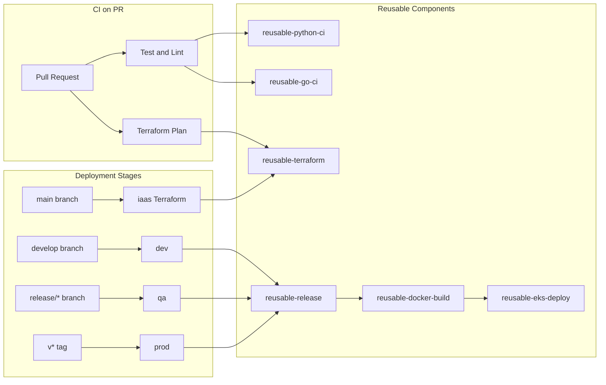

# Module 14 project — GitHub Actions CI/CD for EKS and Terraform

Hands-on lab for [Module 14](../README.md): a multi-service monorepo with reusable GitHub Actions, OIDC to AWS, Terraform per environment, and EKS deploys.

Treat this `project/` directory as the Git repository root when you copy it into a dedicated repo. Workflows and path filters assume `services/`, `infra/terraform/`, and `.github/` sit at that root.

**Cost warning:** A real EKS cluster bills for the control plane (~$0.10/hour) plus nodes, NAT, and load balancers. Prefer `terraform plan` and CI dry-runs. Destroy lab clusters when finished.

Production-oriented GitHub Actions pipelines for a multi-service monorepo:

| Service | Stack | Path |
|---------|-------|------|
| Flask API | Python / Flask | `services/flask-api` |
| FastAPI | Python / FastAPI | `services/fastapi-api` |
| Go API | Go | `services/go-api` |

Infrastructure is managed with Terraform under `infra/terraform/` for **dev**, **qa**, **prod**, and **iaas**.

## Architecture



## Workflows

| Workflow | Trigger | Purpose |
|----------|---------|---------|
| `ci.yml` | PR / push to `main`, `develop` | Lint, test, Terraform plan (changed paths only) |
| `deploy-dev.yml` | Push to `develop` | Build, push to ECR, deploy to dev EKS |
| `deploy-qa.yml` | Push to `release/**` | Build, push to ECR, deploy to QA EKS |
| `deploy-prod.yml` | Tag `v*.*.*` | Build, push to ECR, deploy to prod EKS (approval gate) |
| `terraform-iaas.yml` | PR / push to `main` (IaaS paths) | Plan or apply shared IaaS foundation |

## Reusable components

### Composite actions (`.github/actions/`)

- `setup-python-service` — Python toolchain and pip cache
- `setup-go-service` — Go toolchain and module cache
- `configure-aws` — OIDC authentication to AWS
- `docker-build-push` — Buildx build and ECR push
- `deploy-eks` — `kubectl set image` and rollout
- `setup-terraform` — Terraform install and init

### Reusable workflows (`.github/workflows/reusable-*.yml`)

- `reusable-python-ci.yml` — Ruff lint + pytest
- `reusable-go-ci.yml` — `go vet` + `go test`
- `reusable-docker-build.yml` — Per-service image publish
- `reusable-eks-deploy.yml` — Per-service EKS rollout
- `reusable-terraform.yml` — fmt, validate, plan/apply
- `reusable-release.yml` — Orchestrates build + deploy for all services

## GitHub setup

### 1. Environments

Create GitHub environments: `dev`, `qa`, `prod`, `iaas`.

| Environment | Recommended protection |
|-------------|------------------------|
| `dev` | None |
| `qa` | Optional reviewers |
| `prod` | Required reviewers + wait timer |
| `iaas` | Required reviewers |

### 2. Environment variables

Set these **variables** on each environment:

| Variable | Example |
|----------|---------|
| `AWS_REGION` | `us-east-1` |
| `ECR_REGISTRY` | `123456789012.dkr.ecr.us-east-1.amazonaws.com` |
| `EKS_CLUSTER_NAME` | `monorepo-dev-eks` |
| `K8S_NAMESPACE` | `apps` |

### 3. Secrets

| Secret | Used by |
|--------|---------|
| `AWS_ROLE_ARN_DEV` | dev deploy + terraform |
| `AWS_ROLE_ARN_QA` | qa deploy + terraform |
| `AWS_ROLE_ARN_PROD` | prod deploy + terraform |
| `AWS_ROLE_ARN_IAAS` | iaas terraform |

### 4. AWS OIDC trust

Create an IAM OIDC provider for `token.actions.githubusercontent.com` and IAM roles per environment. Example trust policy:

```json
{
  "Version": "2012-10-17",
  "Statement": [
    {
      "Effect": "Allow",
      "Principal": {
        "Federated": "arn:aws:iam::ACCOUNT_ID:oidc-provider/token.actions.githubusercontent.com"
      },
      "Action": "sts:AssumeRoleWithWebIdentity",
      "Condition": {
        "StringEquals": {
          "token.actions.githubusercontent.com:aud": "sts.amazonaws.com"
        },
        "StringLike": {
          "token.actions.githubusercontent.com:sub": "repo:ORG/REPO:environment:dev"
        }
      }
    }
  ]
}
```

Repeat for `qa`, `prod`, and `iaas` environments with scoped permissions.

### 5. Terraform remote state

Update `infra/terraform/environments/*/backend.tf` with your S3 bucket and DynamoDB lock table. Copy `terraform.tfvars.example` to `terraform.tfvars` per environment.

### 6. ECR repositories

Create ECR repos matching service names: `flask-api`, `fastapi-api`, `go-api`.

### 7. Kubernetes deployments

Ensure each environment has deployments named after the services (`flask-api`, `fastapi-api`, `go-api`) in the namespace configured by `K8S_NAMESPACE`.

## Branching model

```
main        → production releases, IaaS Terraform apply
develop     → automatic dev deployments
release/x   → automatic QA deployments
v1.2.3 tag  → production deployment (all services)
```

## Local development

```bash
# Flask API
cd services/flask-api && pip install -r requirements-dev.txt && pytest

# FastAPI
cd services/fastapi-api && pip install -r requirements-dev.txt && pytest

# Go API
cd services/go-api && go test ./...
```

## Manual runs

All deploy and Terraform workflows support `workflow_dispatch` with service toggles and optional Terraform apply for non-IaaS stages.
